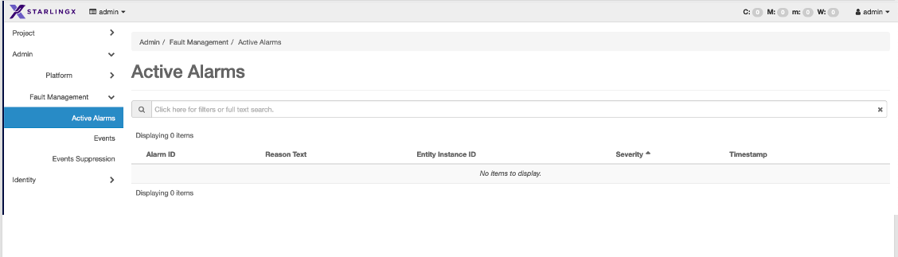

# Starlingx Familiarization

Get to know StarlingX Management services. There are two sections to
this document; the first is familiarization of using the GUI and the
second session is how to use the CLI to see the same inforamation.

Useful links:
- [CLI Reference](https://docs.starlingx.io/cli_ref/index.html)
- [REST API](https://docs.starlingx.io/api-ref/index.html)
- [System Configuration](https://docs.starlingx.io/system_configuration/index-sysconf-d511820651f0.html)

# From the GUI

## Log in to the GUI

Open a browser and go to the assigned address from the class.  

> Note: Normally this would be the floating IP address and port 8080.


## Review the Host Inventory and alarm status


## See the Host Detailed Information

From the inventory page, click on the controller-0 


## Review the details and options for the Nodes


This is where nodes details can be viewed and modified.  For example
- Huge pages can be adjusted under the Memory link
- Processor configuration (Application or Application Isolated) settings can be configured
- Storage and partitions for the node can be created
- BMC Sensors can be configured and discovered


## Review the System Configuration

Review and learn how to change the system configuration


From this tab the following changes can be performed
- Address Pools - Create/update addresss pools for the hosts
- DNS - Edit the Cluster DNS
- NTP - Edit NTP address ranges
- OAM IP - View / Change the OAM IP address
- Controller Filesystem - Modify / Update the Controller filesystem sizes

## Edit the System Name

Click on the System tab and then click on Edit System


Change the System name 


The name is now changed


## Explore Fault Management

Click on Fault Management


View Active Alarms



View Events

>Note: Notice the setting and clearing of the same event IDs


# From SSH / CLI

## Log in to the SSH

To log in using SSH use the assigned address.  For example `ssh sysadmin@147.75.35.13 -p 2201`  The username is sysadmin password is `St8rlingX*`

```
Warning: Permanently added '[147.75.35.13]:2201' (ED25519) to the list of known hosts.
Release 22.12
------------------------------------------------------------------------
W A R N I N G *** W A R N I N G *** W A R N I N G *** W A R N I N G ***
------------------------------------------------------------------------
THIS IS A PRIVATE COMPUTER SYSTEM.
This computer system including all related equipment, network devices
(specifically including Internet access), are provided only for authorized use.
All computer systems may be monitored for all lawful purposes, including to
ensure that their use is authorized, for management of the system, to
facilitate protection against unauthorized access, and to verify security
procedures, survivability and operational security. Monitoring includes active
attacks by authorized personnel and their entities to test or verify the
security of the system. During monitoring, information may be examined,
recorded, copied and used for authorized purposes. All information including
personal information, placed on or sent over this system may be monitored. Uses
of this system, authorized or unauthorized, constitutes consent to monitoring
of this system. Unauthorized use may subject you to criminal prosecution.
Evidence of any such unauthorized use collected during monitoring may be used
for administrative, criminal or other adverse action. Use of this system
constitutes consent to monitoring for these purposes.

sysadmin@147.75.35.13's password:

WARNING: Unauthorized access to this system is forbidden and will be
prosecuted by law. By accessing this system, you agree that your
actions may be monitored if unauthorized usage is suspected.

Linux controller-0 5.10.0-6-rt-amd64 #1 SMP PREEMPT_RT StarlingX Debian 5.10.162-1.stx.33 (2023-02-11 x86_64
Last login: Fri Jun  9 20:21:43 2023 from 2604:1380:4642:a300::12
sysadmin@controller-0:~$
```

## Review the Host Inventory and alarm status

From the SSH session see the alarms

```
source /etc/platform/openrc
fm alarm-summary
+-----------------+--------------+--------------+----------+
| Critical Alarms | Major Alarms | Minor Alarms | Warnings |
+-----------------+--------------+--------------+----------+
| 0               | 0            | 0            | 0        |
+-----------------+--------------+--------------+----------+

system host-list
+----+--------------+-------------+----------------+-------------+--------------+
| id | hostname     | personality | administrative | operational | availability |
+----+--------------+-------------+----------------+-------------+--------------+
| 1  | controller-0 | controller  | unlocked       | enabled     | available    |
+----+--------------+-------------+----------------+-------------+--------------+
```

## See the Host Detailed Information

### See the general host info

```
source /etc/platform/openrc
system host-show controller-0
+------------------------+-------------------------------------------------------------------------+
| Property               | Value                                                                   |
+------------------------+-------------------------------------------------------------------------+
| action                 | none                                                                    |
| administrative         | unlocked                                                                |
| apparmor               | disabled                                                                |
| availability           | available                                                               |
| bm_ip                  | None                                                                    |
| bm_type                | none                                                                    |
| bm_username            | None                                                                    |
| boot_device            | /dev/disk/by-path/pci-0000:00:17.0-ata-5.0                              |
| capabilities           | {'is_max_cpu_configurable': 'configurable', 'Personality': 'Controller- |
|                        | Active'}                                                                |
| clock_synchronization  | ntp                                                                     |
| config_applied         | 6361bdd7-c54c-41ae-a688-3edf8f288974                                    |
| config_status          | None                                                                    |
| config_target          | 6361bdd7-c54c-41ae-a688-3edf8f288974                                    |
| console                | ttyS1,115200                                                            |
| created_at             | 2023-06-07T10:16:55.370878+00:00                                        |
| device_image_update    | None                                                                    |
| hostname               | controller-0                                                            |
| id                     | 1                                                                       |
| install_output         | graphical                                                               |
| install_state          | None                                                                    |
| install_state_info     | None                                                                    |
| inv_state              | inventoried                                                             |
| invprovision           | provisioned                                                             |
| location               | {}                                                                      |
| max_cpu_mhz_allowed    | 5000                                                                    |
| max_cpu_mhz_configured | None                                                                    |
| mgmt_ip                | fd00:4888:2000:1090::b                                                  |
| mgmt_mac               | 00:00:00:00:00:00                                                       |
| operational            | enabled                                                                 |
| personality            | controller                                                              |
| reboot_needed          | False                                                                   |
| reserved               | False                                                                   |
| rootfs_device          | /dev/disk/by-path/pci-0000:00:17.0-ata-5.0                              |
| serialid               | None                                                                    |
| software_load          | 22.12                                                                   |
| subfunction_avail      | available                                                               |
| subfunction_oper       | enabled                                                                 |
| subfunctions           | controller,worker,lowlatency                                            |
| task                   |                                                                         |
| tboot                  |                                                                         |
| ttys_dcd               | False                                                                   |
| updated_at             | 2023-06-11T17:37:46.775260+00:00                                        |
| uptime                 | 370757                                                                  |
| uuid                   | e033d415-267f-4878-b8bc-b60391c1131d                                    |
| vim_progress_status    | services-enabled                                                        |
+------------------------+-------------------------------------------------------------------------+
```

### See the host specific details

> Note: Commands are listed without output

```
source /etc/platform/openrc
system host-cpu-list controller-0
system host-memory-list controller-0
system host-port-list controller-0
system host-if-list controller-0

```

## Review the System Configuration

The following CLI commands can be used to see the System Configuration

> Note: Commands are listed without output

```
source /etc/platform/openrc
system show
system addrpool-list
system dns-show
system ntp-show
system oam-show
system controllerfs-list
```

## Edit the System Name

```
source /etc/platform/openrc
system modify -n MyFirstStarlingXCloudCLI
    +----------------------+--------------------------------------+
    | Property             | Value                                |
    +----------------------+--------------------------------------+
    | contact              | None                                 |
    | created_at           | 2023-06-07T10:16:13.205695+00:00     |
    | description          |                                      |
    | https_enabled        | False                                |
    | latitude             | None                                 |
    | location             | None                                 |
    | longitude            | None                                 |
    | name                 | MyFirstStarlingXCloudCLI             |
    | region_name          | RegionOne                            |
    | sdn_enabled          | False                                |
    | security_feature     | spectre_meltdown_v1                  |
    | service_project_name | services                             |
    | software_version     | 22.12                                |
    | system_mode          | simplex                              |
    | system_type          | All-in-one                           |
    | timezone             | UTC                                  |
    | updated_at           | 2023-06-11T19:07:44.127908+00:00     |
    | uuid                 | 660affdc-bc7b-4aa2-9434-b20b848ff787 |
    | vswitch_type         | none                                 |
    +----------------------+--------------------------------------+

system show
    +----------------------+--------------------------------------+
    | Property             | Value                                |
    +----------------------+--------------------------------------+
    | contact              | None                                 |
    | created_at           | 2023-06-07T10:16:13.205695+00:00     |
    | description          |                                      |
    | https_enabled        | False                                |
    | latitude             | None                                 |
    | location             | None                                 |
    | longitude            | None                                 |
    | name                 | MyFirstStarlingXCloudCLI             |
    | region_name          | RegionOne                            |
    | sdn_enabled          | False                                |
    | security_feature     | spectre_meltdown_v1                  |
    | service_project_name | services                             |
    | software_version     | 22.12                                |
    | system_mode          | simplex                              |
    | system_type          | All-in-one                           |
    | timezone             | UTC                                  |
    | updated_at           | 2023-06-11T19:10:13.132540+00:00     |
    | uuid                 | 660affdc-bc7b-4aa2-9434-b20b848ff787 |
    | vswitch_type         | none                                 |
    +----------------------+--------------------------------------+
```


## Explore Fault Management

> Note: Commands are listed without output

```
source /etc/platform/openrc
fm alarm-list
fm event-list
```