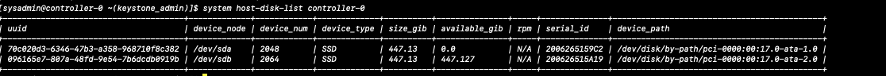
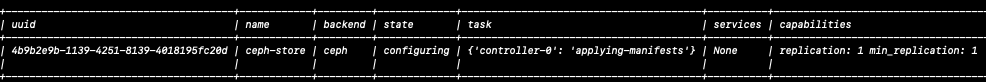
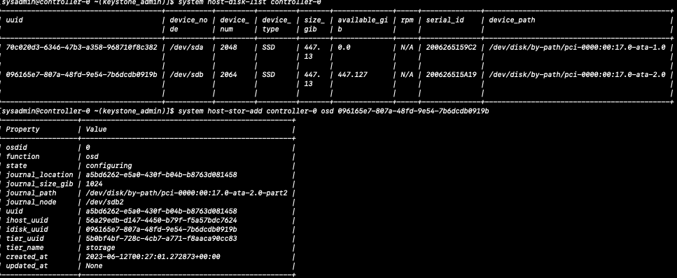

# AIO-Simplex

Install and bootstrap overview:
1. Prep the node for Installation<br/>
2. Install StarlingX on node<br/>
3. Bootstrap the controller node<br/>
  3.1 Create the override file<br/>
  3.2 Bootstrap the system<br/>
4. Configure the controller node<br/>
5. Unlock the controller node<br/>


For details on the Equninix metal installs and bootstrap see [Jumphost](../jumphost-setup/jump-host.md).<br/>
For details on simplex installation, see:<br/>
- [StarlingX on libvirt](../libvirt/README.md)<br/>
- [StarlingX on virutalbox](../virtualbox/readme.md)<br/>
- And visit the [StarlingX Installation and deployment guide](https://docs.starlingx.io/deploy_install_guides/index-install-e083ca818006.html) page. <br/>

For the purpose of time, steps 1 through 3 have been completed and we will start with step 4. But first, let's go over the ansible override file.

### Ansible override file: /home/sysadmin/localhost.yml

This file overrides default values found in /usr/share/ansible/stx-ansible/playbooks/host_vars/bootstrap/default.yml. For the purposes of this workshop, we are overriding system and network properties.

```
system_mode: simplex
name: "c3sxda-tc9"
description: "STX8 Standalone SX"
location: "Dallas"
contact: "babak.sarashki@windriver.com"
timezone: UTC

dns_servers:
  - "2001:4860:4860::8888"
  - "2001:4860:4860::8844"

external_oam_subnet: "2604:1380:4642:a300::100/124"
external_oam_gateway_address: "2604:1380:4642:a300::101"
external_oam_floating_address: "2604:1380:4642:a300::102"

management_subnet: "fd00:4888:2000:1090::/64"
management_start_address: "fd00:4888:2000:1090::a"
management_end_address: "fd00:4888:2000:1090::ffff"
management_multicast_subnet: "ff05::18:1:0/64"

cluster_host_subnet: "fd00:4888:2000:109a::/64"
cluster_pod_subnet: "fd00:4888:2000:109b::/64"
cluster_service_subnet: "fd00:4888:2000:109b::/112"

admin_password: St8rlingX*
ansible_become_pass: St8rlingX*

additional_local_registry_images:
  - windse/cyclictest:v1.0
```


### Bootstraping
	
To bootstrap the node, place the above override file has been placed in /home/sysadmin/ and issue:

***You must be user sysadmin***
```
export ANSIBLE_LOG_PATH=~/ansible_$(date "+%Y%m%d%H%M%S").log
time ansible-playbook /usr/share/ansible/stx-ansible/playbooks/bootstrap.yml
```

The stdout of the above command has been captured and is on the [JumpHost](http://147.75.35.13/logs). This is in addition to the ansible.log file on the controller.

### LAB1: Configure controller-0

In this step we will configure the node for the hands-on labs. To this end, we will configure the system with Ceph storage, and isolated CPU's.<br/>
See [StarlingX Target List](../jumphost-setup/jumphost-targets.md) for ***Port numbers***
#### Step 0: OAM network address


Source the environment: ` source /etc/platform/openrc`

Determine the OAM interface: `ip -6 r  | grep ^default`<br/>
Identify OAM Interface: `default via 2604:1380:4642:a300::151 dev enp1s0f0 metric 1024 onlink pref medium`

***Next, assign network interface to OAM network***
```
OAMIF=enp1s0f0
C=controller-0

system host-if-modify $C $OAMIF -n oam0 -c platform
system interface-network-assign $C oam0 oam
system ntp-modify ntpservers=0.pool.ntp.org,1.pool.ntp.org
system host-unlock $C
```

The above will reboot the system and apply the configuration. Next we will configure the system with Isolated CPU's and Ceph.

Upon reboot, [check system](check-system-upon-reboot.md) for any alarms and system status. If no errors are found, proceed with [Ceph based persistent sotrage backend](#Ceph-based-persistent-storage-backend)  and configure the system for [Isolated cpus](#IsolatedCPUs).

### Ceph based persistent storage backend

In this step we will add Persistent Ceph Storage. To this end, start by reviewing the server available disks:

#### From command line:

```
source /etc/platform/openrc
system host-disk-list controller-0
```

<br/>


##### Add storage backend
```
system storage-backend-add ceph --confirmed
```
<br/>


##### Add OSD

```
# use: system host-disk-list to list the systems disks and obtain the disk uuid
system host-stor-add controller-0 osd <disk uuid>
```

<br/>

---
### IsolatedCPUs

StarlingX supports isolating CPU cores from the underlying Linux and Kubernetes schedulers, and from interrupts by setting the IRQ-affinity. This is a run-to-completion model is best suited for vRAN uses-cases such as Intel's FlexRAN and NVIDIA's AerialSDK, among others. In this segment we will Isolate a number of CPU's.

#### First List CPU's

```
[sysadmin@controller-0 ~(keystone_admin)]$ system host-cpu-list controller-0
+------...---+-------+-----------+-------+--------+---------...------------+-------------------+
| uuid ...   | log_c | processor | phy_c | thread | processo...            | assigned_function |
|      ...   | ore   |           | ore   |        |         ...            |                   |
+------...---+-------+-----------+-------+--------+---------...------------+-------------------+
| bd668...70 | 0     | 0         | 0     | 0      | Intel(R)...  @ 3.40GHz | Platform          |
| 2b3c2...15 | 1     | 0         | 1     | 0      | Intel(R)...  @ 3.40GHz | Application       |
| 56eff...af | 2     | 0         | 2     | 0      | Intel(R)...  @ 3.40GHz | Application       |
| 0abc1...0b | 3     | 0         | 3     | 0      | Intel(R)...  @ 3.40GHz | Application       |
| ea4c0...b5 | 4     | 0         | 4     | 0      | Intel(R)...  @ 3.40GHz | Application       |
| e6082...ad | 5     | 0         | 5     | 0      | Intel(R)...  @ 3.40GHz | Application       |
| 33f3d...ed | 6     | 0         | 6     | 0      | Intel(R)...  @ 3.40GHz | Application       |
| 59677...74 | 7     | 0         | 7     | 0      | Intel(R)...  @ 3.40GHz | Application       |
| 362cc...51 | 8     | 0         | 0     | 1      | Intel(R)...  @ 3.40GHz | Platform          |
| bf866...11 | 9     | 0         | 1     | 1      | Intel(R)...  @ 3.40GHz | Application       |
| 2d43d...d0 | 10    | 0         | 2     | 1      | Intel(R)...  @ 3.40GHz | Application       |
| 8063c...e6 | 11    | 0         | 3     | 1      | Intel(R)...  @ 3.40GHz | Application       |
| 134cf...78 | 12    | 0         | 4     | 1      | Intel(R)...  @ 3.40GHz | Application       |
| 45d24...7e | 13    | 0         | 5     | 1      | Intel(R)...  @ 3.40GHz | Application       |
| 9d262...d1 | 14    | 0         | 6     | 1      | Intel(R)...  @ 3.40GHz | Application       |
| 222b1...57 | 15    | 0         | 7     | 1      | Intel(R)...  @ 3.40GHz | Application       |
+------...---+-------+-----------+-------+--------+---------...------------+-------------------+
```


#### Isolate 4 CPU Cores

```
system host-lock controller-0
system host-cpu-modify controller-0 -f application-isolated -p0 4


```

##### Expected results:

```
[sysadmin@controller-0 ~(keystone_admin)]$ host-cpu-modify controller-0 -f application-isolated -p0 4
+------...---+-------+-----------+-------+--------+---------...------------+----------------------+
| uuid ...   | log_c | processor | phy_c | thread | processo...            | assigned_function    |
|      ...   | ore   |           | ore   |        |         ...            |                      |
+------...---+-------+-----------+-------+--------+---------...------------+----------------------+
| bd668...70 | 0     | 0         | 0     | 0      | Intel(R)...  @ 3.40GHz | Platform             |
| 2b3c2...15 | 1     | 0         | 1     | 0      | Intel(R)...  @ 3.40GHz | Application-isolated |
| 56eff...af | 2     | 0         | 2     | 0      | Intel(R)...  @ 3.40GHz | Application-isolated |
| 0abc1...0b | 3     | 0         | 3     | 0      | Intel(R)...  @ 3.40GHz | Application-isolated |
| ea4c0...b5 | 4     | 0         | 4     | 0      | Intel(R)...  @ 3.40GHz | Application-isolated |
| e6082...ad | 5     | 0         | 5     | 0      | Intel(R)...  @ 3.40GHz | Application          |
| 33f3d...ed | 6     | 0         | 6     | 0      | Intel(R)...  @ 3.40GHz | Application          |
| 59677...74 | 7     | 0         | 7     | 0      | Intel(R)...  @ 3.40GHz | Application          |
| 362cc...51 | 8     | 0         | 0     | 1      | Intel(R)...  @ 3.40GHz | Platform             |
| bf866...11 | 9     | 0         | 1     | 1      | Intel(R)...  @ 3.40GHz | Application-isolated |
| 2d43d...d0 | 10    | 0         | 2     | 1      | Intel(R)...  @ 3.40GHz | Application-isolated |
| 8063c...e6 | 11    | 0         | 3     | 1      | Intel(R)...  @ 3.40GHz | Application-isolated |
| 134cf...78 | 12    | 0         | 4     | 1      | Intel(R)...  @ 3.40GHz | Application-isolated |
| 45d24...7e | 13    | 0         | 5     | 1      | Intel(R)...  @ 3.40GHz | Application          |
| 9d262...d1 | 14    | 0         | 6     | 1      | Intel(R)...  @ 3.40GHz | Application          |
| 222b1...57 | 15    | 0         | 7     | 1      | Intel(R)...  @ 3.40GHz | Application          |
+------...---+-------+-----------+-------+--------+---------...------------+----------------------+

```

#### Complete the process and Unlock the host

```
system host-label-assign controller-0 kube-cpu-mgr-policy=static
system host-label-assign controller-0 kube-topology-mgr-policy=restricted
system host-unlock controller-0
```
---

### Example Apps

- [Cyclic Test](app-cyclictest.md)
- [StarlingX Hello World](app-hello-starlingx.md)
- [Kubernetes Dashboard](app-kubernetes-dashboard.md)
- [Persistent Storage](app-hello-persistent-storage.md)
- [Install Matrix Server](https://docs.starlingx.io/admintasks/kubernetes/kubernetes-admin-tutorials-metrics-server.html)
