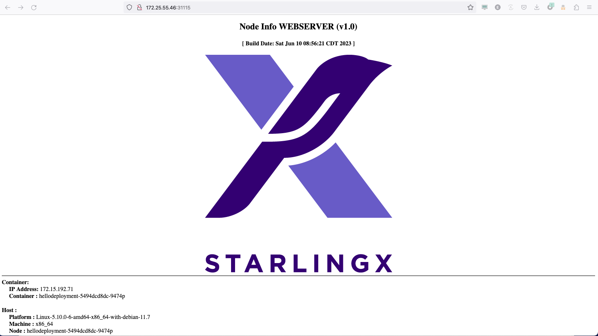

# Hello StarlingX

This is a very simple example of how to expose node port from the primary CNI to access the pod

# Deploy
## From the active Controller, Create a Deployment for the App

```
cat <<EOF > hello-deployment.yaml 
apiVersion: apps/v1 # for versions before 1.6.0 use extensions/v1beta1
kind: Deployment
metadata:
  name: hellodeployment
spec:
  replicas: 2
  selector:
    matchLabels:
      app: hellodeployment
  template:
    metadata:
      labels:
        app: hellodeployment
    spec:
      containers:
      - name: hellostarlingx
        image: windse/starlingx-nodeinfo:v1.0
        imagePullPolicy: Always
        ports:
        - containerPort: 80
          protocol: TCP
EOF
```

## From the active Controller, Create the node port for outside access

```
cat <<EOF > nodeport.yaml
apiVersion: v1
kind: Service
metadata:
  name: nodeport
  labels:
    app: hellodeployment
spec:
  type: NodePort
  ports:
    - port: 80
      protocol: TCP
      targetPort: 80
      nodePort: 31115
  selector:
    app: hellodeployment
EOF
```

# From the active Controller, Launch the application

```
kubectl apply -f hello-deployment.yaml 
kubectl apply -f nodeport.yaml
```

# Validate
Validate the container is accessible by using curl or a browser to access the container

## Using curl

```
IP=$(source /etc/platform/openrc;system oam-show |grep oam_ip | awk '{ print $4 }')
curl http://$IP:31115
```

### Example Output

```
<CENTER><h2>Node Info WEBSERVER (v1.0)</h2></CENTER><CENTER><h4>[ Build Date: Sat Jun 10 08:56:21 CDT 2023 ]</h4></CENTER><CENTER></CENTER><HR><b>Container:</b><br/><b>&nbsp&nbsp&nbsp&nbsp IP Address:</b> 172.15.192.72<br/><b>&nbsp&nbsp&nbsp&nbsp Container :</b> hellodeployment-5494dcd8dc-g9xxl<br/><br/><b>Host      :</b><br/><b>&nbsp&nbsp&nbsp&nbsp Platform  :</b> Linux-5.10.0-6-amd64-x86_64-with-debian-11.7<br/><b>&nbsp&nbsp&nbsp&nbsp Machine   :</b> x86_64<br/><b>&nbsp&nbsp&nbsp&nbsp Node      :</b> hellodeployment-5494dcd8dc-g9xxl<br/><b>&nbsp&nbsp&nbsp&nbsp System    :</b> Linux<br/><b>&nbsp&nbsp&nbsp&nbsp Release   :</b> 5.10.0-6-amd64<br/><b>&nbsp&nbsp&nbsp&nbsp Version   :</b> #1 SMP PREEMPT StarlingX Debian 5.10.152-1.stx.27 (2022-12-19)<br/><b>&nbsp&nbsp&nbsp&nbsp Uname     :</b> uname_result(system='Linux', node='hellodeployment-5494dcd8dc-g9xxl', release='5.10.0-6-amd64', version='#1 SMP PREEMPT StarlingX Debian 5.10.152-1.stx.27 (2022-12-19)', machine='x86_64', processor='')<br/><br/><b>Resources :</b><br/><b>&nbsp&nbsp&nbsp&nbsp CPUs      :</b> 4<br/><b>&nbsp&nbsp&nbsp&nbsp Memory(GB):</b> 28.61846160888672<br/><HR>
```

## Using Web Browser from a machine that can access the Cloud
Open a web browswer to the floating IP Address (http://<Controller FIP>:31115



# From the active Controller, Cleanup

```
kubectl delete -f nodeport.yaml
kubectl delete -f hello-deployment.yaml 
```
