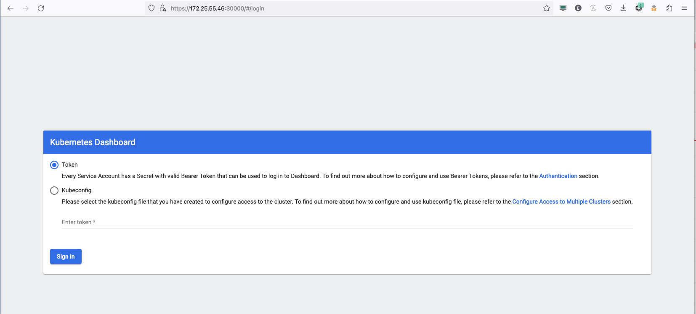
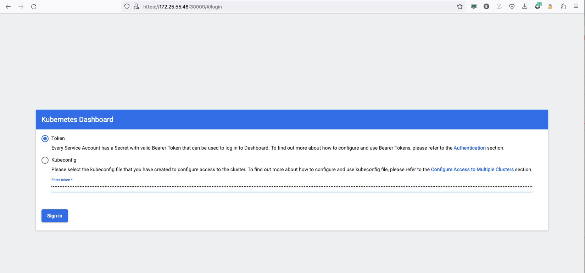

# Setup Kubernetes Dashboard
- [Dashboard development page](https://kubernetes.io/docs/tasks/access-application-cluster/web-ui-dashboard/)
- [Credit original work](https://computingforgeeks.com/how-to-install-kubernetes-dashboard-with-nodeport/)

# Create the pod

## Get the version
```
VER=$(curl -s https://api.github.com/repos/kubernetes/dashboard/releases/latest|grep tag_name|cut -d '"' -f 4)
```

## Create the pod
```
kubectl apply -f https://raw.githubusercontent.com/kubernetes/dashboard/$VER/aio/deploy/recommended.yaml
```

## Create a patch that changes the  kubernetes-dashboard service to use a NodePort 

```
cat << EOF > nodeport_patch.yaml
spec:
  ports:
  - nodePort: 30000
    port: 443
    protocol: TCP
    targetPort: 8443
  type: NodePort
EOF
```

## Apply the patch

```
kubectl -n kubernetes-dashboard patch svc kubernetes-dashboard --patch-file nodeport_patch.yaml
```

### Verify the patch applied

If the kubernetes-dashboard line below shows TYPE NodePort and PORT(S) 443:30000 then the patch applied correctly

```
kubectl -n kubernetes-dashboard get services
NAME                        TYPE        CLUSTER-IP     EXTERNAL-IP   PORT(S)         AGE
dashboard-metrics-scraper   ClusterIP   10.12.92.149   <none>        8000/TCP        5m3s
kubernetes-dashboard        NodePort    10.7.148.78    <none>        443:30000/TCP   5m3s
```

# Create admin user yaml file
```
cat << EOF > adminuser.yaml
apiVersion: v1
kind: ServiceAccount
metadata:
  name: admin-user
  namespace: kubernetes-dashboard
EOF
```

## Apply the admin user

```
kubectl apply -f adminuser.yaml
```

# Create an Admin Rolebinding
```
cat <<EOF > dashboard-admin-rolebinding.yaml 
apiVersion: rbac.authorization.k8s.io/v1
kind: ClusterRoleBinding
metadata:
  name: admin-user
roleRef:
  apiGroup: rbac.authorization.k8s.io
  kind: ClusterRole
  name: cluster-admin
subjects:
- kind: ServiceAccount
  name: admin-user
  namespace: kubernetes-dashboard
EOF
```

## Apply the Role Binding
```
kubectl -n kubernetes-dashboard create -f dashboard-admin-rolebinding.yaml 
```

# Get the token
```
kubectl -n kubernetes-dashboard create token admin-user
```

## Expected output
```
dGVyLmxvY2FsIiwia3ViZXJuZXRlcy5pbyI6eyJuYW1lc3BhY2UiOiJrdWJlcm5ldGVzLWRhc2hib2FyZCIsInNlcnZpY2VhY2NvdW50Ijp7Im5hbWUiOiJhZG1pbi11c2VyIiwidWlkIjoiOTE3MDUyZTEtNGNlYy00ODI4LWIwZTQtYTljNWFmZDgzOTFjIn19LCJuYmYiOjE2ODY0MTQ0OTksInN1YiI6InN5c3RlbTpzZXJ2aWNlYWNjb3VudDprdWJlcm5ldGVzLWRhc2hib2FyZDphZG1pbi11c2VyIn0.ofn9mzeGuSH6uLaMl7MW24ZQTIeLxUKUrPATiNDII0NpHMeUKDWvuG7yAwgS2GhUVZETHajf-4wMTl7NT0fY0UEqLCWCbyBF931QWkVWnrqHoMWh6ydBls9_MLzXeK1pzd2Qg1oAth8Q0o4wJ-ndUhsBCq_VOXXtcFwn0k_ujo0Tm4jgatKGOr2TeGrKjwhgvTXbiZL4Fmxk5HKYeM8KvATBMRxzFYN2r_SRnjz1Jeu-LpDrkrQYo8nqxdddxOojx--t7GTOtmABpgi2io-7EDsbsmrMJrf8YaoFhwmg-bAhQjkQSVwizg-j202kSBCfeoYIKDCqTcgVrFkhAodlLQ
```

> NOTE: Copy the above output to log into the dashboard

# Using Web Browser from a machine that can access the Cloud

- Open a web browser to the Floating IP (FIP) and port 30000 (https://**controller FIP**:30000

- Select accept to accept security risk

- SELECT  the `Token` option for signing in to the Kubernetes Dashboard.



- Paste the token in the "Enter Token" field.


- Verify access to the dashboard


> NOTE: First time login change the Dropdown at the top left to "All Namespaces"


# Cleanup

```
kubectl delete -f adminuser.yaml
kubectl delete -n  kubernetes-dashboard -f dashboard-admin-rolebinding.yaml 
kubectl delete -f https://raw.githubusercontent.com/kubernetes/dashboard/v2.7.0/aio/deploy/recommended.yaml
```