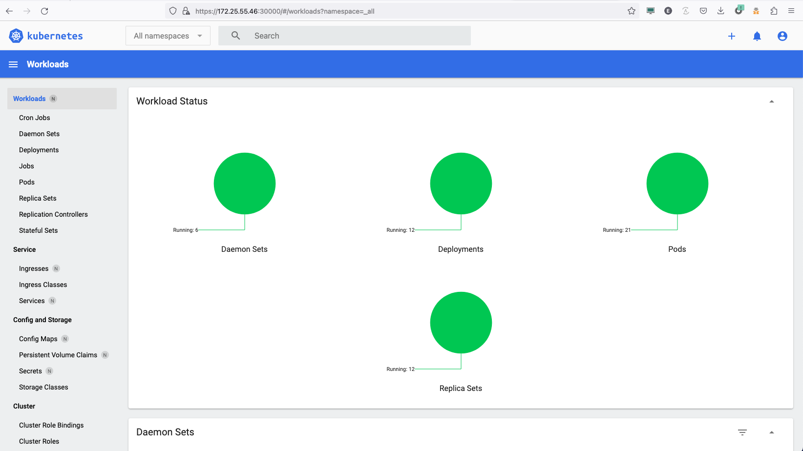
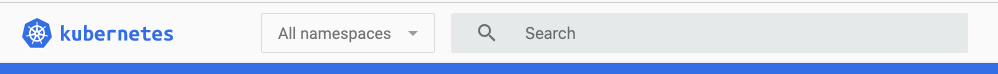

# Setup Kubernetes Dashboard
- [Dashboard development page](https://kubernetes.io/docs/tasks/access-application-cluster/web-ui-dashboard/)
- [Credit original work](https://computingforgeeks.com/how-to-install-kubernetes-dashboard-with-nodeport/)

## Create the docker registry secret

> NOTE: The registry secret only needs to be created once and is used for all the app examples.  

```
kubectl create namespace kubernetes-dashboard
PASSWORD=St8rlingX*
kubectl -n kubernetes-dashboard create secret docker-registry admin-registry-secret \
      --docker-server=registry.local:9001 --docker-username=admin --docker-password=$PASSWORD \
      --docker-email=noreply@windriver.com

```

# Create the pod

## Copy the yaml file to the controller
Using the assigned [SSH proxy port](../jumphost-setup/jumphost-targets.md) copy the yaml files

For Example
```
scp -P 2201 yamls/app-kubernetes-dashboard/*.yaml sysadmin@147.75.35.13:.

```

## From the Controller, Create the pod
```
kubectl apply -f recommended.yaml
```

### From the Controller, Verify the pods are in good health

If the kubernetes-dashboard line below shows TYPE NodePort and PORT(S) 443:30000 then the patch applied correctly

```
kubectl -n kubernetes-dashboard get services
NAME                        TYPE        CLUSTER-IP     EXTERNAL-IP   PORT(S)         AGE
dashboard-metrics-scraper   ClusterIP   10.12.92.149   <none>        8000/TCP        5m3s
kubernetes-dashboard        NodePort    10.7.148.78    <none>        443:30000/TCP   5m3s
```

## From the Controller, Apply the admin user

```
kubectl apply -f adminuser.yaml
```

## From the Controller, Apply the Role Binding
```
kubectl -n kubernetes-dashboard create -f dashboard-admin-rolebinding.yaml 
```

# From the Controller, Get the Admin token
```
kubectl -n kubernetes-dashboard create token admin-user
```

## Expected output
```
dGVyLmxvY2FsIiwia3ViZXJuZXRlcy5pbyI6eyJuYW1lc3BhY2UiOiJrdWJlcm5ldGVzLWRhc2hib2FyZCIsInNlcnZpY2VhY2NvdW50Ijp7Im5hbWUiOiJhZG1pbi11c2VyIiwidWlkIjoiOTE3MDUyZTEtNGNlYy00ODI4LWIwZTQtYTljNWFmZDgzOTFjIn19LCJuYmYiOjE2ODY0MTQ0OTksInN1YiI6InN5c3RlbTpzZXJ2aWNlYWNjb3VudDprdWJlcm5ldGVzLWRhc2hib2FyZDphZG1pbi11c2VyIn0.ofn9mzeGuSH6uLaMl7MW24ZQTIeLxUKUrPATiNDII0NpHMeUKDWvuG7yAwgS2GhUVZETHajf-4wMTl7NT0fY0UEqLCWCbyBF931QWkVWnrqHoMWh6ydBls9_MLzXeK1pzd2Qg1oAth8Q0o4wJ-ndUhsBCq_VOXXtcFwn0k_ujo0Tm4jgatKGOr2TeGrKjwhgvTXbiZL4Fmxk5HKYeM8KvATBMRxzFYN2r_SRnjz1Jeu-LpDrkrQYo8nqxdddxOojx--t7GTOtmABpgi2io-7EDsbsmrMJrf8YaoFhwmg-bAhQjkQSVwizg-j202kSBCfeoYIKDCqTcgVrFkhAodlLQ
```

> NOTE: Copy the above output to log into the dashboard

# Using Web Browser from a machine that can access the Cloud

- Open a web browser and got to the https://147.75.35.13 use the [K8Dashboard port](../jumphost-setup/jumphost-targets.md).  

  For example `https://147.75.35.13:30100`

> NOTE: Normally this is the floating IP (FIP) and port 30000 (https://**controller FIP**:30000

- Select accept to accept security risk

- SELECT  the `Token` option for signing in to the Kubernetes Dashboard.


- Paste the token in the "Enter Token" field.


- Verify access to the dashboard


> NOTE: First time login change the Dropdown at the top left to "All Namespaces"



# Cleanup

```
kubectl delete -f adminuser.yaml
kubectl delete -n  kubernetes-dashboard -f dashboard-admin-rolebinding.yaml 
kubectl delete -f https://raw.githubusercontent.com/kubernetes/dashboard/v2.7.0/aio/deploy/recommended.yaml
```