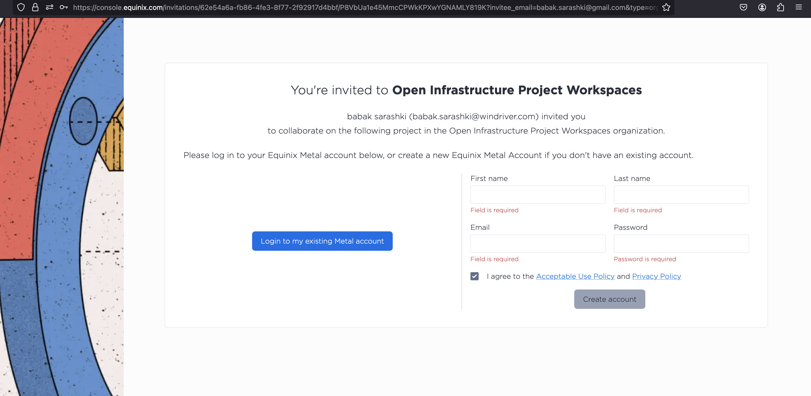
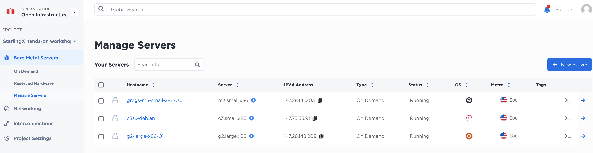
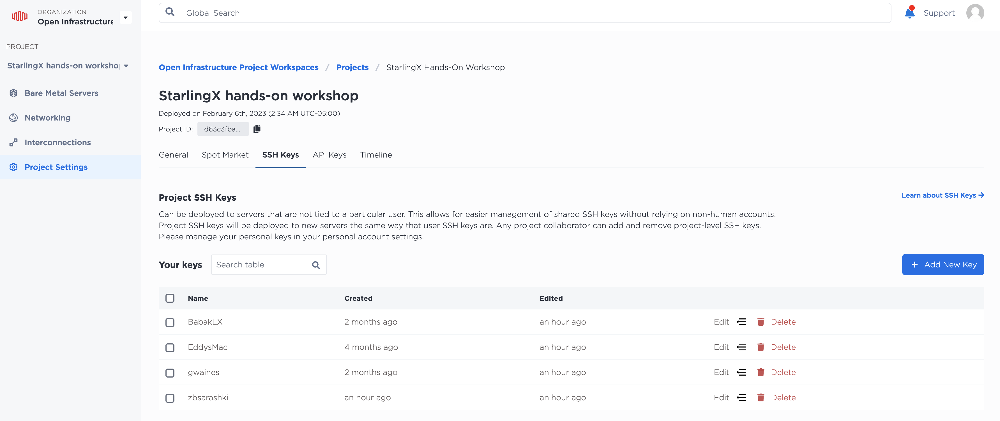

# 
OpenInfra Summit Vancouver  2023 StarlingX Hands-on Lab Open Infrastructure Project Workspaces Equinix Metal  Add your public ssh keys to the project

---

Invitation email to join the project has been sent out from support@equninix.com. Once the invitation is accepted, login and add your ssh-key to the project.

---

Accept the invitation email from support@equinix.com and create an account.

---

Once the above step is complete and you have your email validated, login to equinix and add your pub ssh-key.

From the landing page, GOTO Project Settings and SSH Keys

 AND add your SSH Pub Keys: 

 

[Prev: Using Equinix Metal](using_equinix_metal.md) 
