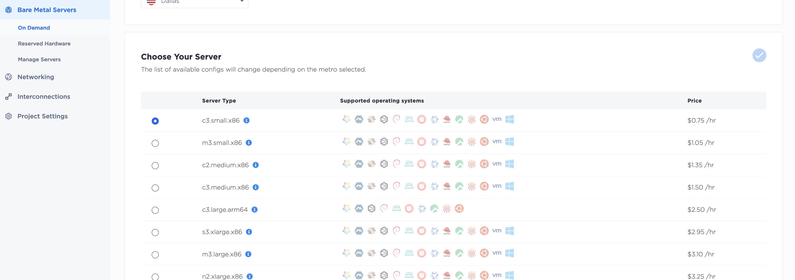

# 
OpenInfra Summit Vancouver  2023 StarlingX Hands-on Lab Open Infrastructure Project Workspaces  Create Starlingx on Demand

---

Provision a Bare Metal server and configure its OS to install StarlingX over IPXE. The steps are identical to the previous segment, except instead of selecting Debian, select custom-ipxe. ***Make sure to select IPV6 with /124 prefix***

### Provision on Demand Equinix Metal

 

### Select OS

 

 ***Next give a unique name to the machine*** 

For the naming of the host, follow this rule for Targets:

Name your server as: c3sxda-\<your username\>-***stx***, where 
c3sx == c3.small.x86 
da == Dallas 

### Ensure ipv6 prefix is /124 

 
 

***And Deploy the box*** 

[Prev: Debian on Demand Metal](IPXEServer.md) 
[Prev: Using Equinix Metal](using_equinix_metal.md) 
