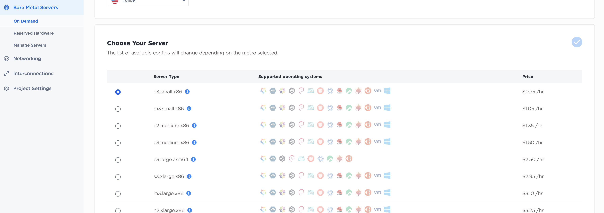
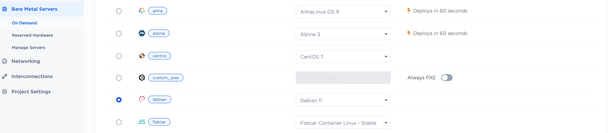
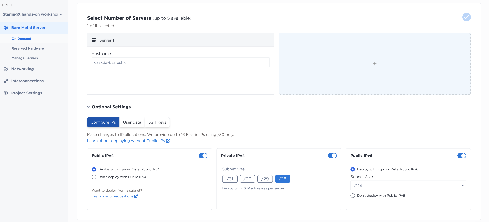

# <p style="text-align: center;">OpenInfra Summit<br/>Vancouver  2023<br/>StarlingX Hands-on Lab<br/>Open Infrastructure Project Workspaces<br/><br/>Create Debian on Demand<br/>Setup IPXE</p>

---

Equinix Metal™ supports passing custom iPXE scripts during provisioning  which allows you to install a custom operating system manually. When you provision a server, Equinix Metal first loads a custom iPXE build that will serve up the chain-loaded iPXE script URL that you specify.

In this segment, we will provision a Debian Metal and setup ipxe with Starlingx. The steps include:

- Provision on Demand Equinix Metal with Debian
- Setup ipxe
	- Install http / apache2
	- Download and setup starlingX install media for ipxe server
	- Create boot.php and update index.html
	- Edit kick starter files

---

## Provision on Demand Equinix Metal with Debian


### We are selecting c3.small.x86 in Dallas.



---

### Next select Debian 11 OS




### Next give a unique name to the machine.

For the naming of the host, follow this rule:

Name your server as: c3sxda-<your username>, where<br/>
c3sx == c3.small.x86<br/>
da == dallas<br/>

### Ensure ipv6 prefix is set to /124



---

## Setup IPXE
### Install http / apache2

From the "Manage Servers" page find your systems's IP address and ssh to it, thereafter:

```
apt-get update
apt-get install apache2 rsync expect
cd /var/www/html
STXRELEASE8=mirror.starlingx.cengn.ca/mirror/starlingx/release/8.0.0
wget https://$STXRELEASE8/debian/monolithic/outputs/iso/starlingx-intel-x86-64-cd.iso
mkdir stx8
mount starlingx-intel-x86-64-cd.iso /mnt
cd /mnt && rsync -avr . $OLDPWD/stx8
cd /var/www/html
```

### Create index.html for ipxe

- Get the IP address of your server:
```
bash# ip a l bond0
5: bond0: <BROADCAST,MULTICAST,MASTER,UP,LOWER_UP> mtu 1500 qdisc noqueue state...
    link/ether b4:96:91:84:37:e0 brd ff:ff:ff:ff:ff:ff
	    inet 147.75.35.13/31 brd 255.255.255.255 scope global bond0

bash# export MYSERVERIP=147.75.35.13
```

- Update the index.html with ipxe script
- Set your servers IP address

```
cd /var/www/html
export MYSERVERIP=147.75.35.13
cat > index.html  << EOF
#!ipxe
####       OpenInfra Summit Vancouver 2023        ####
#### see https://vancouver2023.openinfra.dev/     ####
#### see https://www.starlingx.io/                ####
set conn_type http
set serverip $MYSERVERIP
chain http://\${serverip}/boot.php
exit
EOF
```

- Expected result:

```
root@c3sxda-bsarashk:/var/www/html# cat index.html 
#!ipxe
####       OpenInfra Summit Vancouver 2023        ####
#### see https://vancouver2023.openinfra.dev/     ####
#### see https://www.starlingx.io/                ####
set conn_type http
set serverip 147.75.35.13
chain http://${serverip}/boot.php
exit
root@c3sxda-bsarashk:/var/www/html# 
```

### Create boot.php

```
cd /var/www/html
export MYSERVERIP=147.75.35.13
cat > boot.php << EOF
#!ipxe

set server_ip $MYSERVERIP
imgfree
initrd --name initrd http://\${server_ip}/stx8/pxeboot/initrd
kernel http://\${server_ip}/stx8/pxeboot/bzImage-rt initrd=http://\${server_ip}/stx8/pxeboot/initrd defaultkernel=vmlinuz-*-rt-amd64 traits=controller,worker,lowlatency instname=debian instbr=starlingx instsh=0 instab=0  inst_ostree_root=/dev/mapper/cgts--vg-root--lv inst_ostree_var=/dev/mapper/cgts--vg-var--lv ks=http://\${server_ip}:80/stx8/kickstart/kickstart.cfg insturl=http://\${server_ip}:80/stx8/ostree_repo biosdevname=0 biosplusefi=1 efi=runtime instdev=/dev/sda root=/dev/ram0 rdinit=/install  console=ttyS1,115200  panic=30 ksdevice=bootif BOOTIF=\${netX/mac} selinux=0
boot
EOF
```

## Edit KickStarter files

StarlingX allows [prestaging](https://docs.starlingx.io/dist_cloud/kubernetes/prestage-a-subcloud-using-dcmanager-df756866163f.html) of nodes with software packages and container image archives that are required for the deployment.  This is the typical installation mode for sub-clouds and starts by updating the default Install Media with update-iso.sh tool. The resultant media is then used to pre-install the sub-clouds. Its main purpose is to speed up the deployment process.

In this setup, however, neither physical nor virtual media are applicable; hence, we resort to modifying a kickstarter file for this purpose.

<br/>

[Prev: Using Equinix Metal](using_equinix_metal.md)<br/>
[Next: StarlingX on Demand Metal](EquinixStarlingX.md)<br/>
