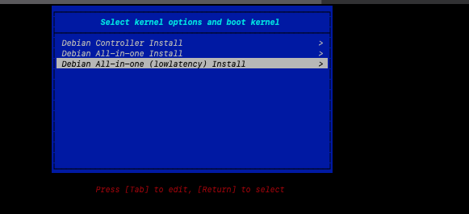
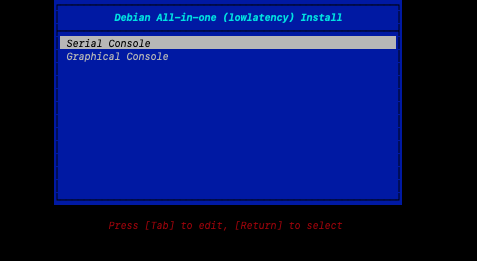
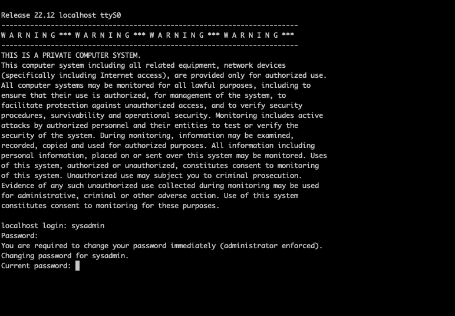

# Libvirt
--- Tested on StarlingX8 

This readme documents how to use stx-tools on ubuntu system and install StarlingX AIO Simplex on VM. For detailed installation guide see Prepare Host Environment under [StarlingX Installation guide](https://docs.starlingx.io/r/stx.8.0/deploy_install_guides/release/virtual/aio_simplex_environ.html).

- Install dependencies
- Clone stx-tools
- Download StarlingX ISO image
- Setup VM Network and Controller configuration
- Install, Bootstrap and deploy

## Clone stx-tools

```
git clone https://opendev.org/starlingx/tools.git

```

## Install dependencies

This example is based on Ubuntu 20.04. Install required packages

```
cd tools/deployment/libvirt/
sh ./install_packages.sh
apt install -y apparmor-profiles ufw
ufw disable
```

## Download Install media:

```
R=mirror.starlingx.cengn.ca
I=starlingx-intel-x86-64-cd.iso
C=https://$R/mirror/starlingx/release/8.0.0/debian/monolithic/outputs/iso/$I
wget $C
```

---

## Setup network configuation

```
sudo bash
cd ~/tools/deployment/libvirt
./setup_network.sh
exit # sudo exit
```

***Expected results***

```
user0@g2-large-x86-01:~/tools/deployment/libvirt$ brctl show
bridge name     bridge id               STP enabled     interfaces
stxbr1          8000.000000000000       no
stxbr2          8000.000000000000       no
stxbr3          8000.000000000000       no
stxbr4          8000.000000000000       no
virbr0          8000.525400f687dc       yes             virbr0-nic
user0@g2-large-x86-01:~/tools/deployment/libvirt$ 
```

# Setup controller configuration

```
sudo bash
C=/home/user0/starlingx-intel-x86-64-cd.iso
./setup_configuration.sh -i $C -c simplex
exit # sudo
```

---

## Install

Reach device console with<br/>

```
sudo virsh console simplex-controller-0
```

The above gives access to the serial console and boot loader. For AIO-Simplex select "All-in-one"<br/>

<br/>And select Serial Console<br/>


# First Time login

Once the software is installed the system will reboot. To log into the system for the first time use username sysadmin and password sysadmin. When prompted set the password. For this document we are using 'St8rlingX\*'



## Bootstrap

Set the ip address of the interfaces
```
sudo bash
ip a a 10.10.10.2/24 dev enp2s1
ip l s up dev enp2s1
ip r a default via 10.10.10.1
ping 8.8.8.8
exit # sudo exit
```


***Create bootstrap Override file***<br/>
***Do this part as sysadmin***<br/>
```
cd ~
cat <<EOF > localhost.yml
system_mode: simplex

dns_servers:
- 8.8.8.8
- 8.8.4.4

external_oam_subnet: 10.10.10.0/24
external_oam_gateway_address: 10.10.10.1
external_oam_floating_address: 10.10.10.2

admin_username: admin
admin_password: St8rlingX*
ansible_become_pass: St8rlingX*
EOF
```

***Run ansible-playbook***<br/>

```
time ansible-playbook /usr/share/ansible/stx-ansible/playbooks/bootstrap.yml
```

***Expected results***<br/>
```
PLAY RECAP *********************************************************************
localhost  : ok=439  changed=250  unreachable=0    failed=0    skipped=452  rescued=0    ignored=0

Thursday 01 June 2023  08:41:30 +0000 (0:00:00.568)       0:34:22.671 *********
===============================================================================
bootstrap/persist-config : Wait for service endpoints reconfiguration to complete - 390.18s
bootstrap/apply-manifest : Applying puppet bootstrap manifest --------- 371.37s
bootstrap/bringup-essential-services : Wait for 120 seconds to ensure kube-system...- 120.72s
bootstrap/persist-config : Wait for sysinv inventory ------------------- 63.65s
bootstrap/bringup-bootstrap-applications : Wait until application is in the appl...-- 55.46s
bootstrap/persist-config : Find old registry secrets in Barbican ------- 44.90s
bootstrap/validate-config : Generate config ini file for python sysinv db popula...-- 40.24s
bootstrap/bringup-bootstrap-applications : Wait until application is in the appl...-- 30.31s
bootstrap/bringup-bootstrap-applications : pause ----------------------- 30.04s
bootstrap/persist-config : Saving config in sysinv database ------------ 29.82s
bootstrap/bringup-essential-services : Add loopback interface ---------- 20.24s
bootstrap/bringup-essential-services : Check controller-0 is in online state -- 19.47s
common/bringup-kubemaster : Initializing Kubernetes master ------------- 18.15s
bootstrap/bringup-bootstrap-applications : Save the current systeim ...sequ....lays -- 17.96s
bootstrap/bringup-bootstrap-applications : Wait until application is in the ...ate -- 15.13s
bootstrap/persist-config : Restart sysinv-agent and sysinv-api to pick up sy...te -- 10.59s
common/bringup-kubemaster : Activate Calico Networking ------------------ 7.77s
bootstrap/bringup-bootstrap-applications : Wait until application is in the u... --- 6.17s
bootstrap/bringup-bootstrap-applications : Check if application already exists --- 5.65s
bootstrap/bringup-bootstrap-applications : Apply application ------------ 5.15s

real    34m24.464s
user    14m26.286s
sys     3m29.651s
```

***Configure Controller-0***<br/>
```
source /etc/platform/openrc
OAM_IF=enp2s1
system host-if-modify controller-0 $OAM_IF -c platform
system interface-network-assign controller-0 $OAM_IF oam
system host-unlock controller-0
```


***Upon reboot login to the system and source the enviornment***
```
sysadmin@controller-0:~$ source /etc/platform/openrc
[sysadmin@controller-0 ~(keystone_admin)]$ system host-list
+----+--------------+-------------+----------------+-------------+--------------+
| id | hostname     | personality | administrative | operational | availability |
+----+--------------+-------------+----------------+-------------+--------------+
| 1  | controller-0 | controller  | unlocked       | enabled     | available    |
+----+--------------+-------------+----------------+-------------+--------------+

[sysadmin@controller-0 ~(keystone_admin)]$ fm alarm-list

[sysadmin@controller-0 ~(keystone_admin)]$
```

***Destroy the configuration with:***<br/>

```
sudo bash
./destroy_configuration.sh -c simplex
./destroy_network.sh
exit # sudo exit
```
[Prev](../Readme.md)<br/>
