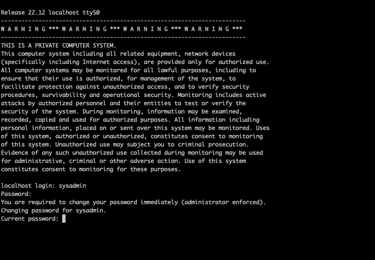

# Virtual box setup
-- Tested on StarlingX 8

This readme documents how to use Virtualbox to install StarlingX AIO Simplex

- Install [Virtualbox](https://www.virtualbox.org/)
- Install VirtualBox extenstion pack ([Download](https://download.virtualbox.org/virtualbox/6.0.14/Oracle_VM_VirtualBox_Extension_Pack-6.0.14.vbox-extpack))
- Make sure the VBoxManage program is in your path.  Test by doing `VBoxManage --help`

The setup below has Virtualbox network using NAT.  This prevents issues running on certian networks.  In order to access the VM from your local machine port  forwarding rules are setup by default.  
These can be found under the settings->network.  Under the adapter-1 click on "port forwarding." See below for screenshots.  

This allows you to ssh using port 2221 and access the main StarlingX control web page.
- access to the StarlingX web page is via `http://localhost:8181`.  
- ssh access is `ssh -p 2221 sysadmin@localhost`
- Copy files using `scp -P 2221 <myfile> sysadmin:localhost:.`

## Network setup 


## Port Forwarding


# Download required StarlingX Images
- Download the files from [windshare](http://mirror.starlingx.cengn.ca/mirror/starlingx/)


# Additional Requirements
- bash shell.  For Mac and Linux this will work out of the box.  For Windows it's recommended to install [Mobaxterm](https://mobaxterm.mobatek.net/)
- Install [socat](https://linux.die.net/man/1/socat)- This isn't required but it makes things a lot easier to deal with the serial console. This works on Linux, Mac, and Windows with Mobaxterm.

# Installation
The following steps are for creating the VM and installing StarlingX.

# Edit the variables for creating the images
The file common.sh contains all the variables used for creating the VM, modify it to  to match your needs (See common.sh for details):

In particular the following:
```
    # This is the locaiton the of the install iso
	export SERVER_ISO=
    # This is the name of the VM
	export CONTROLLER_0=
    # This is the location of the VM disks
    export VIRTUAL_BOX_STORAGE
    # This is the number of CPUs for the VM. Minimum is 3
    export CONTROLLER_CPUS=4

```

# Create the VM to use

## For Unix/Mac

```
./create_vms.sh
```

## For Windows

```
.\create_vms.sh

```

# Start the controller to install TIS:

- Start the VM.  Can use the GUI or can use `./start.sh`

By default start.sh uses socat to use the serial port.  This can be changed; see the script for details.

> Note for Mac users the screen is very small.  The screen can be resized by clicking on the monitor icon on the lower left of the Virtual box window


- When prompted select the following options


> NOTE: If you are using socat select `Serial Console` on the below screen.  If running from the standard VB console select `Graphical Console`


# First time log in

Once the software is installed the system will reboot.  To log into the system for the first time use username sysadmin and password sysadmin.  When prompted set the password.  For this document we are using "St8rlingX*"



# From the controller, initially start the OAM Network

StarlingX does not turn on the network devices by default.  So you need to start the OAM network or set it statically

```
sudo dhclient enp0s3
```

# From the controller, Remote Access to the cloud via ssh, http, etc
As previous stated the system is designed to use nat; to  access the StarlingX ports the following port forwarding is setup

- 2221 -- ssh
- 8181 -- HTTP (horizon)

For example to log into the system using ssh use  `ssh -p 2221 sysadmin@localhost`

# From the controller, validate network address
Make sure the network address is on the 10.0.2.0/24 network

```
hostname -I
10.0.2.15
```

# From the controller, validate network connectivity
Verify name resolution, http and docker access.  Make sure the commands below result in a success.
```
ping google.com
curl http://www.google.com

```

## Example results

- ping google.com
```
    PING google.com (172.217.164.110) 56(84) bytes of data.
    64 bytes from sfo03s18-in-f14.1e100.net (172.217.164.110): icmp_seq=1 ttl=63 time=57.6 ms
    64 bytes from sfo03s18-in-f14.1e100.net (172.217.164.110): icmp_seq=2 ttl=63 time=60.5 ms
```

- curl http://www.google.com
```
<!doctype html><html itemscope="" itemtype="http://schema.org/WebPage" lang="en"><head><meta content="Search the world's information, including webpages, images, videos and more. Google has many special features to help you find exactly what you're looking for." name="description"><meta content="noodp" name="robots"><meta content="text/html; charset=UTF-8" http-equiv="Content-Type"><meta content="/images/branding/googleg/1x/googleg_standard_color_128dp.png" itemprop="image"><title>Google</title><script nonce="uBz49jVByPTy34epSCvsng==">(function(){window.google={kEI:'8AH4XZbaJ5jV-gTw7LjYDw',kEXPI:'0,1353746,5663,730,224,4727,378,206,467,2488,249,10,713,338,175,364,671,483,3,205,73,4,60,6,309,427,208,10,1129468,143,1197710,439,25,329093,1294,12383,4855,32691,15248,867,18544,3335,2,2,6801,364,3319,5505,8384,1119,2,578,728,2432,1361,4323,4968,773,2253,1404,1413,1924,1146,9,1968,6191,1719,1808,1976,2044,5766,1,3142,5297,2054,920,873,1217,2975,2736,1558,2136,1142,3910,3541,2093,620,2884,20,317,236,1745,1192,975,1,368,2778,520,399,910,82,1285,8,2796,814,73,80,601,11,14,1279,2212,202,39,289,149,1103,840,324,193,317,822,1,277,49,3,5,48,157,4101,260,52,1135,1,3,2063,606,789,1050,184,546,49,1325,377,686,1261,245,502,429,44,1009,93,328,1284,16,84,417,2426,2247,473,459,880,29,475,244,534,505,3094,133,773,1548,524,8,727,89,503,1574,2705,507,182,91,1184,70,6513,299,1044,901,588,258,214,133,234,111,154,94,682,1042,2458,273,953,391,1065,6,842,1228,1495,369,1275,108,594,652,26,174,266,561,654,480,809,99,2,433,932,291,255,118,7,630,523,366,128,1746,524,358,1035,2,120,8,427,585,360,97,30,1456,524,9,52,39,42,2,272,507,1,713,1670,65,1,2,1,106,10,2,16,146,138,333,109,373,701,258,523,200,401,410,186,3,6,15,183,87,6,234,334,1,250,14,67,134,73,176,641,58,112,648,85,18,274,1209,114,44,5859137,1873,1804021,4194851,2801171,549,333,444,1,2,80,1,900,896,1,8,1,2,2551,1,748,141,59,736,563,1,4265,1,1,1,1,137,1,700,84,1,8,9,8,11,48,1,9,8,1,14,5,2,3,3,1,3,5,3,3,3,3,3,1,3,3,3,3,25,11,2,2,1,5,1,4,3,2,4,8,2,4,2,4,4,4,13,7,2,4,2,13,2,2,2,2,18,28,2,2,3365796,15538754,3397042,1662865',authuser:0,kscs:'c9c918f0_8AH4XZbaJ5jV-gTw7LjYDw',kGL:'US',kBL:'9hVE'};google.sn='webhp';google.kHL='en';google.jsfs='Ffpdje';})();(function(){google.lc=[];google.li=0;google.getEI=function(a){for(var b;a&&(!a.getAttribute||!(b=a.getAttribute("eid")));)a=a.parentNode;return b||google.kEI};google.getLEI=function(a){for(var b=null;a&&(!a.getAttribute||!(b=a.getAttribute("leid")));)a=a.parentNode;return b};google.https=function(){return"https:"==window.location.protocol};google.ml=function(){return null};google.time=function(){return(new Date).getTime()};google.log=function(a,b,e,c,g){if(a=google.logUrl(a,b,e,c,g)){b=new Image;var d=google.lc,f=google.li;d[f]=b;b.onerror=b.onload=b.onabort=function(){delete d[f]};google.vel&&google.vel.lu&&google.vel.lu(a);b.src=a;google.li=f+1}};google.logUrl=function(a,b,e,c,g){var d="",f=google.ls||"";e||-1!=b.search("&ei=")||(d="&ei="+google.getEI(c),-1==b.search("&lei=")&&(c=google.getLEI(c))&&(d+="&lei="+c));c="";!e&&google.cshid&&-1==b.search("&cshid=")&&"slh"!=a&&(c="&cshid="+google.cshid);a=e||"/"+(g||"gen_204")+"?atyp=i&ct="+a+"&cad="+b+d+f+"&zx="+google.time()+c;/^http:/i.test(a)&&google.https()&&(google.ml(Error("a"),!1,{src:a,glmm:1}),a="");return a};}).call(this);(function(){google.y={};google.x=function(a,b){if(a)var c=a.id;else{do c=Math.random();while(google.y[c])}google.y[c]=[a,b];return!1};google.lm=[];google.plm=function(a){google.lm.push.apply(google.lm,a)};google.lq=[];google.load=function(a,b,c){google.lq.push([[a],b,c])};google.loadAll=function(a,b){google.lq.push([a,b])};}).call(this);google.f={};(function(){document.documentElement.addEventListener("submit",function(b){var a;if(a=b.target){var c=a.getAttribute("data-submitfalse");a="1"==c||"q"==c&&!a.elements.q.value?!0:!1}else a=!1;a&&(b.preventDefault(),b.stopPropagation())},!0);}).call(this);var a=window.location,b=a.href.indexOf("#");if(0<=b){var c=a.href.substring(b+1);/(^|&)q=/.test(c)&&-1==c.indexOf("#")&&a.replace("/search?"+c.replace(/(^|&)fp=[^&]*/g,"")+"&cad=h")};</script><style>#gbar,#guser{font-size:13px;padding-top:1px !important;}#gbar{height:22px}#guser{padding-bottom:7px !important;text-align:right}.gbh,.gbd{border-top:1px solid #c9d7f1;font-size:1px}.gbh{height:0;position:absolute;top:24px;width:100%}@media all{.gb1{height:22px;margin-right:.5em;vertical-align:top}#gbar{float:left}}a.gb1,a.gb4{text-decoration:underline !important}a.gb1,a.gb4{color:#00c !important}.gbi .gb4{color:#dd8e27 !important}.gbf .gb4{color:#900 !important}
</style><style>body,td,a,p,.h{font-family:arial,sans-serif}body{margin:0;overflow-y:scroll}#gog{padding:3px 8px 0}td{line-height:.8em}.gac_m td{line-height:17px}form{margin-bottom:20px}.h{color:#36c}.q{color:#00c}.ts td{padding:0}.ts{border-collapse:collapse}em{font-weight:bold;font-style:normal}.lst{height:25px;width:496px}.gsfi,.lst{font:18px arial,sans-serif}.gsfs{font:17px arial,sans-serif}.ds{display:inline-box;display:inline-block;margin:3px 0 4px;margin-left:4px}input{font-family:inherit}a.gb1,a.gb2,a.gb3,a.gb4{color:#11c !important}body{background:#fff;color:black}a{color:#11c;text-decoration:none}a:hover,a:active{text-decoration:underline}.fl a{color:#36c}a:visited{color:#551a8b}a.gb1,a.gb4{text-decoration:underline}a.gb3:hover{text-decoration:none}#ghead a.gb2:hover{color:#fff !important}.sblc{padding-top:5px}.sblc a{display:block;margin:2px 0;margin-left:13px;font-size:11px}.lsbb{background:#eee;border:solid 1px;border-color:#ccc #999 #999 #ccc;height:30px}.lsbb{display:block}.ftl,#fll a{display:inline-block;margin:0 12px}.lsb{background:url(/images/nav_logo229.png) 0 -261px repeat-x;border:none;color:#000;cursor:pointer;height:30px;margin:0;outline:0;font:15px arial,sans-serif;vertical-align:top}.lsb:active{background:#ccc}.lst:focus{outline:none}</style><script nonce="uBz49jVByPTy34epSCvsng=="></script></head><body bgcolor="#fff"><script nonce="uBz49jVByPTy34epSCvsng==">(function(){var src='/images/nav_logo229.png';var iesg=false;document.body.onload = function(){window.n && window.n();if (document.images){new Image().src=src;}
if (!iesg){document.f&&document.f.q.focus();document.gbqf&&document.gbqf.q.focus();}
}
})();</script><div id="mngb"> <div id=gbar><nobr><b class=gb1>Search</b> <a class=gb1 href="http://www.google.com/imghp?hl=en&tab=wi">Images</a> <a class=gb1 href="http://maps.google.com/maps?hl=en&tab=wl">Maps</a> <a class=gb1 href="https://play.google.com/?hl=en&tab=w8">Play</a> <a class=gb1 href="http://www.youtube.com/?gl=US&tab=w1">YouTube</a> <a class=gb1 href="http://news.google.com/nwshp?hl=en&tab=wn">News</a> <a class=gb1 href="https://mail.google.com/mail/?tab=wm">Gmail</a> <a class=gb1 href="https://drive.google.com/?tab=wo">Drive</a> <a class=gb1 style="text-decoration:none" href="https://www.google.com/intl/en/about/products?tab=wh"><u>More</u> &raquo;</a></nobr></div><div id=guser width=100%><nobr><span id=gbn class=gbi></span><span id=gbf class=gbf></span><span id=gbe></span><a href="http://www.google.com/history/optout?hl=en" class=gb4>Web History</a> | <a  href="/preferences?hl=en" class=gb4>Settings</a> | <a target=_top id=gb_70 href="https://accounts.google.com/ServiceLogin?hl=en&passive=true&continue=http://www.google.com/" class=gb4>Sign in</a></nobr></div><div class=gbh style=left:0></div><div class=gbh style=right:0></div> </div><center><br clear="all" id="lgpd"><div id="lga"><br><br></div><form action="/search" name="f"><table cellpadding="0" cellspacing="0"><tr valign="top"><td width="25%">&nbsp;</td><td align="center" nowrap=""><input name="ie" value="ISO-8859-1" type="hidden"><input value="en" name="hl" type="hidden"><input name="source" type="hidden" value="hp"><input name="biw" type="hidden"><input name="bih" type="hidden"><div class="ds" style="height:32px;margin:4px 0"><input class="lst" style="color:#000;margin:0;padding:5px 8px 0 6px;vertical-align:top" autocomplete="off" value="" title="Google Search" maxlength="2048" name="q" size="57"></div><br style="line-height:0"><span class="ds"><span class="lsbb"><input class="lsb" value="Google Search" name="btnG" type="submit"></span></span><span class="ds"><span class="lsbb"><input class="lsb" id="tsuid1" value="I'm Feeling Lucky" name="btnI" type="submit"><script nonce="uBz49jVByPTy34epSCvsng==">(function(){var id='tsuid1';document.getElementById(id).onclick = function(){if (this.form.q.value){this.checked = 1;if (this.form.iflsig)this.form.iflsig.disabled = false;}
else top.location='/doodles/';};})();</script><input value="AAP1E1EAAAAAXfgQACxJk7MonAIUMDBzJgwM3aHLUwl-" name="iflsig" type="hidden"></span></span></td><td class="fl sblc" align="left" nowrap="" width="25%"><a href="/advanced_search?hl=en&amp;authuser=0">Advanced search</a><a href="/language_tools?hl=en&amp;authuser=0">Language tools</a></td></tr></table><input id="gbv" name="gbv" type="hidden" value="1"><script nonce="uBz49jVByPTy34epSCvsng==">(function(){var a,b="1";if(document&&document.getElementById)if("undefined"!=typeof XMLHttpRequest)b="2";else if("undefined"!=typeof ActiveXObject){var c,d,e=["MSXML2.XMLHTTP.6.0","MSXML2.XMLHTTP.3.0","MSXML2.XMLHTTP","Microsoft.XMLHTTP"];for(c=0;d=e[c++];)try{new ActiveXObject(d),b="2"}catch(h){}}a=b;if("2"==a&&-1==location.search.indexOf("&gbv=2")){var f=google.gbvu,g=document.getElementById("gbv");g&&(g.value=a);f&&window.setTimeout(function(){location.href=f},0)};}).call(this);</script></form><div id="gac_scont"></div><div style="font-size:83%;min-height:3.5em"><br></div><span id="footer"><div style="font-size:10pt"><div style="margin:19px auto;text-align:center" id="fll"><a href="/intl/en/ads/">Advertising Programs</a><a href="/services/">Business Solutions</a><a href="/intl/en/about.html">About Google</a></div></div><p style="color:#767676;font-size:8pt">&copy; 2019 - <a href="/intl/en/policies/privacy/">Privacy</a> - <a href="/intl/en/policies/terms/">Terms</a></p></span></center><script nonce="uBz49jVByPTy34epSCvsng==">(function(){window.google.cdo={height:0,width:0};(function(){var a=window.innerWidth,b=window.innerHeight;if(!a||!b){var c=window.document,d="CSS1Compat"==c.compatMode?c.documentElement:c.body;a=d.clientWidth;b=d.clientHeight}a&&b&&(a!=google.cdo.width||b!=google.cdo.height)&&google.log("","","/client_204?&atyp=i&biw="+a+"&bih="+b+"&ei="+google.kEI);}).call(this);})();(function(){var u='/xjs/_/js/k\x3dxjs.hp.en_US.PXQ6TDUi4mU.O/m\x3dsb_he,d/am\x3dAAMCbAQ/d\x3d1/rs\x3dACT90oHRqO4y1Tn0VIAvndn1UG1WhY4Dyg';
setTimeout(function(){var b=document;var a="SCRIPT";"application/xhtml+xml"===b.contentType&&(a=a.toLowerCase());a=b.createElement(a);a.src=u;google.timers&&google.timers.load&&google.tick&&google.tick("load","xjsls");document.body.appendChild(a)},0);})();(function(){window.google.xjsu='/xjs/_/js/k\x3dxjs.hp.en_US.PXQ6TDUi4mU.O/m\x3dsb_he,d/am\x3dAAMCbAQ/d\x3d1/rs\x3dACT90oHRqO4y1Tn0VIAvndn1UG1WhY4Dyg';})();function _DumpException(e){throw e;}
function _F_installCss(c){}
(function(){google.spjs=false;google.snet=true;google.em=[];google.emw=false;})();(function(){var pmc='{\x22d\x22:{},\x22sb_he\x22:{\x22agen\x22:true,\x22cgen\x22:true,\x22client\x22:\x22heirloom-hp\x22,\x22dh\x22:true,\x22dhqt\x22:true,\x22ds\x22:\x22\x22,\x22ffql\x22:\x22en\x22,\x22fl\x22:true,\x22host\x22:\x22google.com\x22,\x22isbh\x22:28,\x22jsonp\x22:true,\x22msgs\x22:{\x22cibl\x22:\x22Clear Search\x22,\x22dym\x22:\x22Did you mean:\x22,\x22lcky\x22:\x22I\\u0026#39;m Feeling Lucky\x22,\x22lml\x22:\x22Learn more\x22,\x22oskt\x22:\x22Input tools\x22,\x22psrc\x22:\x22This search was removed from your \\u003Ca href\x3d\\\x22/history\\\x22\\u003EWeb History\\u003C/a\\u003E\x22,\x22psrl\x22:\x22Remove\x22,\x22sbit\x22:\x22Search by image\x22,\x22srch\x22:\x22Google Search\x22},\x22ovr\x22:{},\x22pq\x22:\x22\x22,\x22refpd\x22:true,\x22rfs\x22:[],\x22sbpl\x22:24,\x22sbpr\x22:24,\x22scd\x22:10,\x22sce\x22:5,\x22stok\x22:\x22V3YETuPZ2vq7Es7SIlvcnFLWSP0\x22,\x22uhde\x22:false}}';google.pmc=JSON.parse(pmc);})();</script>        </body></html
```

# Bootstrap the system

##  From the controller, create the bootstrap.yml file

> IMPORTANT: The **"admin_password"** and the **"ansible_become_pass"** need to be the password you set when you initialy logged in.

```
cat > localhost.yml << 'EOF'
system_mode: simplex
dns_servers:
  - 8.8.8.8
  - 8.8.4.4

external_oam_subnet: 10.0.2.0/24
external_oam_gateway_address: 10.0.2.2
external_oam_floating_address: 10.0.2.15

admin_password: St8rlingX*
ansible_become_pass: St8rlingX*

EOF
```

## From the controller, run ansible to bootstrap and configure the system (On the controller-0)

```
ANSIBLE_LOG_PATH=~/ansible_$(date "+%Y%m%d%H%M%S").log ansible-playbook /usr/share/ansible/stx-ansible/playbooks/bootstrap.yml
```

> This process takes approximately 45 minutes

## Sample output

The following is a snippet of the output to expect.  Once you see the "PLAY RECAP" line the bootstrap is complete.


```
PLAY [all] *********************************************************************

TASK [common/prepare-env : stat] ***********************************************
Friday 09 June 2023  14:37:52 +0000 (0:00:00.332)       0:00:00.333 ***********
ok: [localhost] => (item=/home/sysadmin/secrets.yml)
ok: [localhost] => (item=/home/sysadmin/localhost_secrets.yml)
ok: [localhost] => (item=/home/sysadmin/site.yml)
ok: [localhost] => (item=/home/sysadmin/localhost.yml)
[DEPRECATION WARNING]: Distribution debian 11 on host localhost should use
/usr/bin/python3, but is using /usr/bin/python for backward compatibility with
prior Ansible releases. A future Ansible release will default to using the
discovered platform python for this host. See https://docs.ansible.com/ansible/
2.10/reference_appendices/interpreter_discovery.html for more information. This
 feature will be removed in version 2.12. Deprecation warnings can be disabled
by setting deprecation_warnings=False in ansible.cfg.

TASK [common/prepare-env : include_vars] ***************************************
Friday 09 June 2023  14:37:54 +0000 (0:00:01.839)       0:00:02.172 ***********
skipping: [localhost] => (item={'changed': False, 'stat': {'exists': False}, 'invocation': {'module_args': {'path': '/home/sysadmin/secrets.yml', 'follow': False, 'get_md5': False, 'get_checksum': True, 'get_mime': True, 'get_attributes': True, 'checksum_algorithm': 'sha1'}}, 'failed': False, 'item': '/home/sysadmin/secrets.yml', 'ansible_loop_var': 'item'})
skipping: [localhost] => (item={'changed': False, 'stat': {'exists': False}, 'invocation': {'module_args': {'path': '/home/sysadmin/localhost_secrets.yml', 'follow': False, 'get_md5': False, 'get_checksum': True, 'get_mime': True, 'get_attributes': True, 'checksum_algorithm': 'sha1'}}, 'failed': False, 'item': '/home/sysadmin/localhost_secrets.yml', 'ansible_loop_var': 'item'})
skipping: [localhost] => (item={'changed': False, 'stat': {'exists': False}, 'invocation': {'module_args': {'path': '/home/sysadmin/site.yml', 'follow': False, 'get_md5': False, 'get_checksum': True, 'get_mime': True, 'get_attributes': True, 'checksum_algorithm': 'sha1'}}, 'failed': False, 'item': '/home/sysadmin/site.yml', 'ansible_loop_var': 'item'})
ok: [localhost] => (item={'changed': False, 'stat': {'exists': True, 'path': '/home/sysadmin/localhost.yml', 'mode': '0644', 'isdir': False, 'ischr': False, 'isblk': False, 'isreg': True, 'isfifo': False, 'islnk': False, 'issock': False, 'uid': 42425, 'gid': 345, 'size': 233, 'inode': 131103, 'dev': 64769, 'nlink': 1, 'atime': 1686321454.7834675, 'mtime': 1686321451.4594674, 'ctime': 1686321451.4594674, 'wusr': True, 'rusr': True, 'xusr': False, 'wgrp': False, 'rgrp': True, 'xgrp': False, 'woth': False, 'roth': True, 'xoth': False, 'isuid': False, 'isgid': False, 'blocks': 8, 'block_size': 4096, 'device_type': 0, 'readable': True, 'writeable': True, 'executable': False, 'pw_name': 'sysadmin', 'gr_name': 'sys_protected', 'checksum': 'e9fea25ff7dfde22bd7fa808d0ccc228a7218bbc', 'mimetype': 'text/plain', 'charset': 'us-ascii', 'version': '1468174647', 'attributes': ['extents'], 'attr_flags': 'e'}, 'invocation': {'module_args': {'path': '/home/sysadmin/localhost.yml', 'follow': False, 'get_md5': False, 'get_checksum': True, 'get_mime': True, 'get_attributes': True, 'checksum_algorithm': 'sha1'}}, 'failed': False, 'item': '/home/sysadmin/localhost.yml', 'ansible_loop_var': 'item'})

TASK [common/prepare-env : Set SSH port] ***************************************
Friday 09 June 2023  14:37:54 +0000 (0:00:00.106)       0:00:02.279 ***********
skipping: [localhost]

TASK [common/prepare-env : Format the ansible host if it is an IP address] *****
Friday 09 June 2023  14:37:54 +0000 (0:00:00.028)       0:00:02.307 ***********
skipping: [localhost]

TASK [common/prepare-env : Check connectivity] *********************************
Friday 09 June 2023  14:37:54 +0000 (0:00:00.027)       0:00:02.335 ***********
skipping: [localhost]

TASK [common/prepare-env : Gather remote SSH public key] ***********************
Friday 09 June 2023  14:37:54 +0000 (0:00:00.030)       0:00:02.366 ***********
skipping: [localhost]

TASK [common/prepare-env : Print warning if ssh-keyscan command is timed out] ***
Friday 09 June 2023  14:37:54 +0000 (0:00:00.027)       0:00:02.393 ***********
skipping: [localhost]

TASK [common/prepare-env : Add remote SSH public keys into the known_hosts] ****
Friday 09 June 2023  14:37:54 +0000 (0:00:00.029)       0:00:02.422 ***********
skipping: [localhost]

TASK [common/prepare-env : Fail if password change response sequence is not defined] ***
Friday 09 June 2023  14:37:54 +0000 (0:00:00.031)       0:00:02.454 ***********
skipping: [localhost]

TASK [common/prepare-env : debug] **********************************************
Friday 09 June 2023  14:37:54 +0000 (0:00:00.022)       0:00:02.476 ***********
skipping: [localhost]

TASK [common/prepare-env : Change initial password] ****************************
Friday 09 June 2023  14:37:54 +0000 (0:00:00.026)       0:00:02.503 ***********
skipping: [localhost]

TASK [common/prepare-env : Gather Host OS release] *****************************
Friday 09 June 2023  14:37:54 +0000 (0:00:00.025)       0:00:02.528 ***********
ok: [localhost]

TASK [common/prepare-env : Set OS Release to Debian] ***************************
Friday 09 June 2023  14:37:54 +0000 (0:00:00.029)       0:00:02.558 ***********
ok: [localhost]

TASK [common/prepare-env : Set OS Release to Centos] ***************************
Friday 09 June 2023  14:37:54 +0000 (0:00:00.024)       0:00:02.582 ***********
skipping: [localhost]

TASK [common/validate-target : set_fact] ***************************************
Friday 09 June 2023  14:37:54 +0000 (0:00:00.026)       0:00:02.609 ***********
ok: [localhost]

TASK [common/validate-target : Gather facts if check_bootstrap_address is turned on] ***
Friday 09 June 2023  14:37:54 +0000 (0:00:00.028)       0:00:02.638 ***********
skipping: [localhost]

TASK [common/validate-target : Retrieve software version number] ***************
Friday 09 June 2023  14:37:54 +0000 (0:00:00.031)       0:00:02.669 ***********
changed: [localhost]

...

TASK [bootstrap/validate-config : set_fact] ************************************
Friday 09 June 2023  14:38:07 +0000 (0:00:00.043)       0:00:15.765 ***********
ok: [localhost] => (item=None)
ok: [localhost] => (item=None)
ok: [localhost] => (item=None)
ok: [localhost] => (item=None)
ok: [localhost] => (item=None)
ok: [localhost] => (item=None)
ok: [localhost] => (item=None)
ok: [localhost] => (item=None)
ok: [localhost]

TASK [bootstrap/validate-config : debug] ***************************************
Friday 09 June 2023  14:38:07 +0000 (0:00:00.150)       0:00:15.915 ***********
ok: [localhost] =>
  msg:
  - System mode is simplex
  - Timezone is UTC
  - Distributed Cloud Role is none
  - Region name is RegionOne
  - DNS servers is ['8.8.8.8', '8.8.4.4']
  - PXE boot subnet is 169.254.202.0/24
  - Management subnet is 192.168.204.0/24
  - Cluster host subnet is 192.168.206.0/24
  - Cluster pod subnet is 172.16.0.0/16
  - Cluster service subnet is 10.96.0.0/12
  - OAM subnet is 10.0.2.0/24
  - OAM gateway is 10.0.2.2
  - OAM floating ip is 10.0.2.15
  - Management dynamic address allocation is True
  - Cluster host dynamic address allocation is True
  - 'Docker registries is {''k8s.gcr.io'': {''url'': None, ''password'': ''secret''}, ''gcr.io'': {''url'': None, ''password'': ''secret''}, ''quay.io'': {''url'': None, ''password'': ''secret''}, ''docker.io'': {''url'': None, ''password'': ''secret''}, ''docker.elastic.co'': {''url'': None, ''password'': ''secret''}, ''ghcr.io'': {''url'': None, ''password'': ''secret''}, ''registry.k8s.io'': {''url'': None, ''password'': ''secret''}, ''icr.io'': {''url'': None, ''password'': ''secret''}}'
  - Docker HTTP proxy is undef
  - Docker HTTPS proxy is undef
  - Docker no proxy list is []
  - Applications are []

...

TASK [bootstrap/validate-config : Generate config ini file for python sysinv db population script] ***
Friday 09 June 2023  14:39:02 +0000 (0:00:00.523)       0:01:11.140 ***********
changed: [localhost] => (item=[BOOTSTRAP_CONFIG])
changed: [localhost] => (item=CONTROLLER_HOSTNAME=controller-0)
changed: [localhost] => (item=SYSTEM_TYPE=All-in-one)
changed: [localhost] => (item=SYSTEM_MODE=simplex)
changed: [localhost] => (item=VIRTUAL_SYSTEM=False)
changed: [localhost] => (item=TIMEZONE=UTC)
changed: [localhost] => (item=DISTRIBUTED_CLOUD_ROLE=none)
changed: [localhost] => (item=REGION_NAME=RegionOne)
changed: [localhost] => (item=SW_VERSION=22.12)
changed: [localhost] => (item=NAMESERVERS=8.8.8.8,8.8.4.4)
changed: [localhost] => (item=PXEBOOT_SUBNET=169.254.202.0/24)
changed: [localhost] => (item=PXEBOOT_START_ADDRESS=169.254.202.1)
changed: [localhost] => (item=PXEBOOT_END_ADDRESS=169.254.202.254)
changed: [localhost] => (item=MANAGEMENT_SUBNET=192.168.204.0/24)
changed: [localhost] => (item=MANAGEMENT_START_ADDRESS=192.168.204.1)
changed: [localhost] => (item=MANAGEMENT_END_ADDRESS=192.168.204.254)
changed: [localhost] => (item=MANAGEMENT_GATEWAY_ADDRESS=undef)
changed: [localhost] => (item=MANAGEMENT_DYNAMIC_ADDRESS_ALLOCATION=True)
changed: [localhost] => (item=MANAGEMENT_INTERFACE=lo)
changed: [localhost] => (item=CONTROLLER_0_ADDRESS=192.168.204.2)
changed: [localhost] => (item=CLUSTER_HOST_SUBNET=192.168.206.0/24)
changed: [localhost] => (item=CLUSTER_HOST_START_ADDRESS=192.168.206.1)
changed: [localhost] => (item=CLUSTER_HOST_END_ADDRESS=192.168.206.254)
changed: [localhost] => (item=CLUSTER_HOST_DYNAMIC_ADDRESS_ALLOCATION=True)
changed: [localhost] => (item=CLUSTER_POD_SUBNET=172.16.0.0/16)
changed: [localhost] => (item=CLUSTER_POD_START_ADDRESS=172.16.0.1)
changed: [localhost] => (item=CLUSTER_POD_END_ADDRESS=172.16.255.254)
changed: [localhost] => (item=CLUSTER_SERVICE_SUBNET=10.96.0.0/12)
changed: [localhost] => (item=CLUSTER_SERVICE_START_ADDRESS=10.96.0.1)
changed: [localhost] => (item=CLUSTER_SERVICE_END_ADDRESS=10.111.255.254)
changed: [localhost] => (item=EXTERNAL_OAM_SUBNET=10.0.2.0/24)
changed: [localhost] => (item=EXTERNAL_OAM_START_ADDRESS=10.0.2.1)
changed: [localhost] => (item=EXTERNAL_OAM_END_ADDRESS=10.0.2.254)
changed: [localhost] => (item=EXTERNAL_OAM_GATEWAY_ADDRESS=10.0.2.2)
changed: [localhost] => (item=EXTERNAL_OAM_FLOATING_ADDRESS=10.0.2.15)
changed: [localhost] => (item=EXTERNAL_OAM_0_ADDRESS=10.0.2.16)
changed: [localhost] => (item=EXTERNAL_OAM_1_ADDRESS=10.0.2.17)
changed: [localhost] => (item=MANAGEMENT_MULTICAST_SUBNET=239.1.1.0/28)
changed: [localhost] => (item=MANAGEMENT_MULTICAST_START_ADDRESS=239.1.1.1)
changed: [localhost] => (item=MANAGEMENT_MULTICAST_END_ADDRESS=239.1.1.14)
changed: [localhost] => (item=SYSTEM_CONTROLLER_SUBNET=none)
changed: [localhost] => (item=SYSTEM_CONTROLLER_FLOATING_ADDRESS=none)
changed: [localhost] => (item=SYSTEM_CONTROLLER_OAM_SUBNET=none)
changed: [localhost] => (item=SYSTEM_CONTROLLER_OAM_FLOATING_ADDRESS=none)
changed: [localhost] => (item=ADMIN_SUBNET=undef)
changed: [localhost] => (item=ADMIN_START_ADDRESS=undef)
changed: [localhost] => (item=ADMIN_END_ADDRESS=undef)
changed: [localhost] => (item=ADMIN_GATEWAY_ADDRESS=undef)
changed: [localhost] => (item=ADMIN_INTERFACE=undef)
changed: [localhost] => (item=DOCKER_HTTP_PROXY=undef)
changed: [localhost] => (item=DOCKER_HTTPS_PROXY=undef)
changed: [localhost] => (item=DOCKER_NO_PROXY=)
changed: [localhost] => (item=K8S_REGISTRY=k8s.gcr.io)
changed: [localhost] => (item=GCR_REGISTRY=gcr.io)
changed: [localhost] => (item=QUAY_REGISTRY=quay.io)
changed: [localhost] => (item=DOCKER_REGISTRY=docker.io)
changed: [localhost] => (item=ELASTIC_REGISTRY=docker.elastic.co)
changed: [localhost] => (item=GHCR_REGISTRY=ghcr.io)
changed: [localhost] => (item=REGISTRYK8S_REGISTRY=registry.k8s.io)
changed: [localhost] => (item=ICR_REGISTRY=icr.io)
changed: [localhost] => (item=K8S_REGISTRY_TYPE=docker)
changed: [localhost] => (item=GCR_REGISTRY_TYPE=docker)
changed: [localhost] => (item=QUAY_REGISTRY_TYPE=docker)
changed: [localhost] => (item=DOCKER_REGISTRY_TYPE=docker)
changed: [localhost] => (item=ELASTIC_REGISTRY_TYPE=docker)
changed: [localhost] => (item=GHCR_REGISTRY_TYPE=docker)
changed: [localhost] => (item=REGISTRYK8S_REGISTRY_TYPE=docker)
changed: [localhost] => (item=ICR_REGISTRY_TYPE=docker)
changed: [localhost] => (item=K8S_REGISTRY_SECURE=True)
changed: [localhost] => (item=GCR_REGISTRY_SECURE=True)
changed: [localhost] => (item=QUAY_REGISTRY_SECURE=True)
changed: [localhost] => (item=DOCKER_REGISTRY_SECURE=True)
changed: [localhost] => (item=ELASTIC_REGISTRY_SECURE=True)
changed: [localhost] => (item=GHCR_REGISTRY_SECURE=True)
changed: [localhost] => (item=REGISTRYK8S_REGISTRY_SECURE=True)
changed: [localhost] => (item=ICR_REGISTRY_SECURE=True)
changed: [localhost] => (item=K8S_REGISTRY_ADDITIONAL_OVERRIDES=undef)
changed: [localhost] => (item=GCR_REGISTRY_ADDITIONAL_OVERRIDES=undef)
changed: [localhost] => (item=QUAY_REGISTRY_ADDITIONAL_OVERRIDES=undef)
changed: [localhost] => (item=DOCKER_REGISTRY_ADDITIONAL_OVERRIDES=undef)
changed: [localhost] => (item=ELASTIC_REGISTRY_ADDITIONAL_OVERRIDES=undef)
changed: [localhost] => (item=GHCR_REGISTRY_ADDITIONAL_OVERRIDES=undef)
changed: [localhost] => (item=REGISTRYK8S_REGISTRY_ADDITIONAL_OVERRIDES=undef)
changed: [localhost] => (item=ICR_REGISTRY_ADDITIONAL_OVERRIDES=undef)
changed: [localhost] => (item=USE_DEFAULT_REGISTRIES=False)
changed: [localhost] => (item=RECONFIGURE_ENDPOINTS=False)
changed: [localhost] => (item=INITIAL_DB_POPULATED=False)
changed: [localhost] => (item=INCOMPLETE_BOOTSTRAP=False)
changed: [localhost] => (item=APISERVER_SANS=)
changed: [localhost] => (item=OIDC_ISSUER_URL=undef)
changed: [localhost] => (item=OIDC_CLIENT_ID=undef)
changed: [localhost] => (item=OIDC_USERNAME_CLAIM=undef)
changed: [localhost] => (item=OIDC_GROUPS_CLAIM=undef)
changed: [localhost] => (item=KUBERNETES_VERSION=1.24.4)

...

TASK [bootstrap/bringup-essential-services : Remove previous management floating address if management network config has changed] ***
Friday 09 June 2023  15:00:06 +0000 (0:00:00.288)       0:22:15.006 ***********
skipping: [localhost]

TASK [bootstrap/bringup-essential-services : Remove previous management virtual address if management network config has changed] ***
Friday 09 June 2023  15:00:06 +0000 (0:00:00.035)       0:22:15.042 ***********
skipping: [localhost]

TASK [common/k8s-bind-mount : Set Kubernetes local directory] ******************
Friday 09 June 2023  15:00:06 +0000 (0:00:00.030)       0:22:15.073 ***********
ok: [localhost]

TASK [common/k8s-bind-mount : Bind Kubernetes stage1 and stage2 directories] ***
Friday 09 June 2023  15:00:06 +0000 (0:00:00.032)       0:22:15.105 ***********
changed: [localhost] => (item=stage1)
changed: [localhost] => (item=stage2)

TASK [bootstrap/bringup-essential-services : Moving existing /etc/hosts to backup and creating a new one with bare minimum entries] ***
Friday 09 June 2023  15:00:08 +0000 (0:00:01.083)       0:22:16.189 ***********
changed: [localhost]

...


TASK [common/push-docker-images : Get docker registries if not in bootstap or restore mode] ***
Friday 09 June 2023  15:00:30 +0000 (0:00:00.032)       0:22:38.605 ***********
skipping: [localhost] => (item={'name': 'k8s_registry', 'value': {'url': 'k8s.gcr.io'}})
skipping: [localhost] => (item={'name': 'gcr_registry', 'value': {'url': 'gcr.io'}})
skipping: [localhost] => (item={'name': 'quay_registry', 'value': {'url': 'quay.io'}})
skipping: [localhost] => (item={'name': 'docker_registry', 'value': {'url': 'docker.io'}})
skipping: [localhost] => (item={'name': 'elastic_registry', 'value': {'url': 'docker.elastic.co'}})
skipping: [localhost] => (item={'name': 'ghcr_registry', 'value': {'url': 'ghcr.io'}})
skipping: [localhost] => (item={'name': 'registryk8s_registry', 'value': {'url': 'registry.k8s.io'}})
skipping: [localhost] => (item={'name': 'icr_registry', 'value': {'url': 'icr.io'}})

...

TASK [common/bringup-kubemaster : Reload systemd] ******************************
Friday 09 June 2023  15:11:07 +0000 (0:00:00.623)       0:33:15.729 ***********
changed: [localhost]

TASK [common/bringup-kubemaster : Create persistent certificate directory] *****
Friday 09 June 2023  15:11:08 +0000 (0:00:01.418)       0:33:17.148 ***********
changed: [localhost]

TASK [common/bringup-kubemaster : Copy certificates] ***************************
Friday 09 June 2023  15:11:09 +0000 (0:00:00.553)       0:33:17.702 ***********
changed: [localhost] => (item=ca.crt)
changed: [localhost] => (item=ca.key)
changed: [localhost] => (item=sa.pub)
changed: [localhost] => (item=sa.key)
changed: [localhost] => (item=front-proxy-ca.crt)
changed: [localhost] => (item=front-proxy-ca.key)

...

PLAY RECAP *********************************************************************
localhost                  : ok=440  changed=250  unreachable=0    failed=0    skipped=451  rescued=0    ignored=0

Friday 09 June 2023  15:20:04 +0000 (0:00:00.692)       0:42:12.573 ***********
===============================================================================
bootstrap/apply-manifest : Applying puppet bootstrap manifest --------- 498.63s
bootstrap/persist-config : Wait for service endpoints reconfiguration to complete - 443.03s
bootstrap/bringup-essential-services : Wait for 120 seconds to ensure kube-system pods are all started - 120.68s
bootstrap/bringup-bootstrap-applications : Wait until application is in the applied state -- 66.89s
bootstrap/persist-config : Find old registry secrets in Barbican ------- 66.16s
bootstrap/persist-config : Wait for sysinv inventory ------------------- 59.72s
bootstrap/bringup-bootstrap-applications : Wait until application is in the applied state -- 45.88s
bootstrap/validate-config : Generate config ini file for python sysinv db population script -- 44.10s
bootstrap/bringup-bootstrap-applications : Save the current system and network config for reference in subsequent replays -- 34.03s
bootstrap/bringup-bootstrap-applications : pause ----------------------- 30.05s
bootstrap/persist-config : Saving config in sysinv database ------------ 26.81s
common/bringup-kubemaster : Initializing Kubernetes master ------------- 23.29s
bootstrap/bringup-essential-services : Check controller-0 is in online state -- 22.25s
bootstrap/bringup-essential-services : Add loopback interface ---------- 18.90s
bootstrap/persist-config : Restart sysinv-agent and sysinv-api to pick up sysinv.conf update -- 13.56s
bootstrap/bringup-bootstrap-applications : Wait until application is in the uploaded state -- 10.58s
bootstrap/bringup-bootstrap-applications : Apply application ----------- 10.32s
common/bringup-kubemaster : Activate Calico Networking ------------------ 9.88s
bootstrap/bringup-bootstrap-applications : Wait until application is in the uploaded state --- 9.67s
bootstrap/bringup-bootstrap-applications : Check if application already exists --- 9.43s

```

# From the controller, deploy the system
If there are no failures from the bootstrap.  Manual deployment is next, if there are failures a reinstall might be required.

> NOTE: Do not reboot the system until you finish the Deploy Step.

## Name the cloud

```
source /etc/platform/openrc
system modify --name="Virtualbox Cloud SX"
system modify --description="All in One"
system modify --contact="eddy.raineri@gmail.com"
```

## Provision Controller-0

```
source /etc/platform/openrc
controller=controller-0
system host-if-modify -n oam0 -c platform $controller enp0s3
system interface-network-assign $controller oam0 oam
system interface-network-list $controller
    +--------------+--------------------------------------+--------+--------------+
    | hostname     | uuid                                 | ifname | network_name |
    +--------------+--------------------------------------+--------+--------------+
    | controller-0 | 3d9efa89-1baa-4ad0-9c15-54fca644e559 | lo     | cluster-host |
    | controller-0 | c6d7547c-cec1-49dc-8fb9-1904aa5534e1 | lo     | mgmt         |
    | controller-0 | fb852fb2-5c5c-4293-b70f-4f283830a979 | oam0   | oam          |
    +--------------+--------------------------------------+--------+--------------+
```

## Network configuration example
```
system host-if-list $controller
    +--------------------------------------+------+----------+----------+---------+------------+----------+-------------+------------+
    | uuid                                 | name | class    | type     | vlan id | ports      | uses i/f | used by i/f | attributes |
    +--------------------------------------+------+----------+----------+---------+------------+----------+-------------+------------+
    | 2c1ec225-4382-49a8-aa47-ab7cce770d0d | oam0 | platform | ethernet | None    | ['enp0s3'] | []       | []          | MTU=1500   |
    | c457030d-dc15-438a-9b42-796659292a7b | lo   | platform | virtual  | None    | []         | []       | []          | MTU=1500   |
    +--------------------------------------+------+----------+----------+---------+------------+----------+-------------+------------+
```

## Configure NTP
```
system ntp-modify ntpservers=1.pool.ntp.org,2.pool.ntp.org
```

## Setup CEPH

```
system storage-backend-add ceph --confirmed
+--------------------------------------+------------+---------+-------------+--------------------------------------------------------------------------------+----------+--------------------+
| uuid                                 | name       | backend | state       | task                                                                           | services | capabilities       |
+--------------------------------------+------------+---------+-------------+--------------------------------------------------------------------------------+----------+--------------------+
| 18ee022d-5b58-4ced-9cec-c098ef60ea16 | ceph-store | ceph    | configuring | {u'controller-1': 'applying-manifests', u'controller-0': 'applying-manifests'} | None     | min_replication: 1 |
|                                      |            |         |             |                                                                                |          | replication: 2     |
+--------------------------------------+------------+---------+-------------+--------------------------------------------------------------------------------+----------+--------------------+
```

### Wait for the storage to be configured

Wait for the state column to be "configured"

```
system storage-backend-list
+--------------------------------------+------------+---------+------------+-------------------+----------+------------------------------------------------------------------+
| uuid                                 | name       | backend | state      | task              | services | capabilities                                                     |
+--------------------------------------+------------+---------+------------+-------------------+----------+------------------------------------------------------------------+
| 18ee022d-5b58-4ced-9cec-c098ef60ea16 | ceph-store | ceph    | configured | provision-storage | None     | min_replication: 1 replication: 2                                |
|                                      |            |         |            |                   |          |                                                                  |
+--------------------------------------+------------+---------+------------+-------------------+----------+------------------------------------------------------------------+
```

## Configure the dedicated storage

Configure the dedicated storage on the controllers

```
DISK_UUID=$(system host-disk-list controller-0 | grep "/dev/sdb" | awk '{print $2}')
system host-stor-add controller-0 $DISK_UUID
+------------------+--------------------------------------------------+-0 $DISK_UUID
| Property         | Value                                            |
+------------------+--------------------------------------------------+
| osdid            | 0                                                |
| function         | osd                                              |
| state            | configuring-on-unlock                            |
| journal_location | 99129bf2-6ef2-40a5-80ca-8ae05e68f3b1             |
| journal_size_gib | 1024                                             |
| journal_path     | /dev/disk/by-path/pci-0000:00:1f.2-ata-2.0-part2 |
| journal_node     | /dev/sdb2                                        |
| uuid             | 99129bf2-6ef2-40a5-80ca-8ae05e68f3b1             |
| ihost_uuid       | 1cd4561b-0dd6-46ec-b1ad-5eb3e3ffc377             |
| idisk_uuid       | 12ab3ed6-bcc3-4a9f-a437-e406f1563204             |
| tier_uuid        | e02bdf93-e4e0-4416-813e-fba941d467d8             |
| tier_name        | storage                                          |
| created_at       | 2023-06-09T16:06:22.156162+00:00                 |
| updated_at       | None                                             |
+------------------+--------------------------------------------------+
```

## Unlock the sytem

```
source /etc/platform/openrc
system host-unlock controller-0
```

## Wait for the system to reboot
The system should reboot after a few minutes


## Verify the system is unlocked
Once the system is rebooted check the status of the platform.  

> NOTE: This will take a few minutes to finish initializing

```
source /etc/platform/openrc
system host-list
+----+--------------+-------------+----------------+-------------+--------------+
| id | hostname     | personality | administrative | operational | availability |
+----+--------------+-------------+----------------+-------------+--------------+
| 1  | controller-0 | controller  | unlocked       | enabled     | available    |
+----+--------------+-------------+----------------+-------------+--------------+
```

## Verify the system is alarm free

> If alarms exist the `fm alarm-list` command will follow up with the alarms.  If not alarms are present nothing will show

```
source /etc/platform/openrc
fm alarm-list

```

# Create a hello world pod
See [Hello World Echo Server])https://www.bmc.com/blogs/kubernetes-basics-tutorial/)

```
kubectl create deployment  helloworld --image=gcr.io/google_containers/echoserver:1.4 --port=8080  --replicas=2
kubectl get deployments
kubectl describe deployments helloworld
kubectl expose deployment helloworld --type=NodePort 
kubectl get services
# Get the pods until the show running
kubectl get pods
    NAME                          READY   STATUS    RESTARTS   AGE
    helloworld-7d6fcc657f-n6d24   1/1     Running   0          9s
    helloworld-7d6fcc657f-skq6t   1/1     Running   0          9s

PORT=$(kubectl get services helloworld --output=jsonpath='{.spec.ports[0].nodePort}')

curl localhost:$PORT

# Logs for each connection will show here
kubectl logs helloworld-7d6fcc657f-n6d24
    10.0.2.15 - - [09/Jun/2023:16:54:48 +0000] "GET / HTTP/1.1" 200 385 "-" "curl/7.74.0"
    10.0.2.15 - - [09/Jun/2023:16:56:24 +0000] "GET / HTTP/1.1" 200 385 "-" "curl/7.74.0"

```
## Delete the hello world pod
```
kubectl delete service helloworld
kubectl delete deployment helloworld
```
